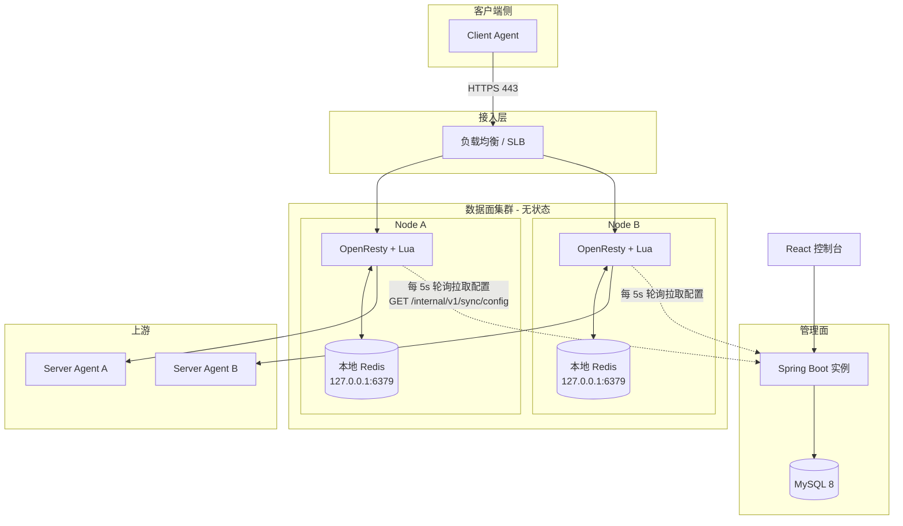
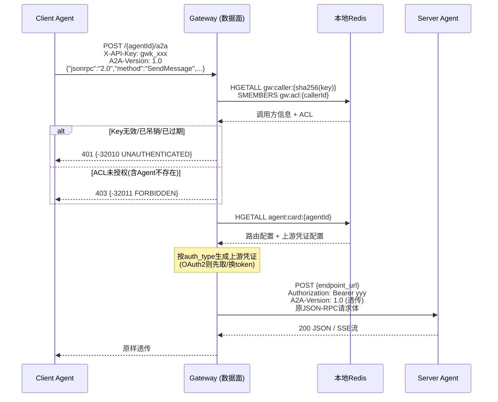
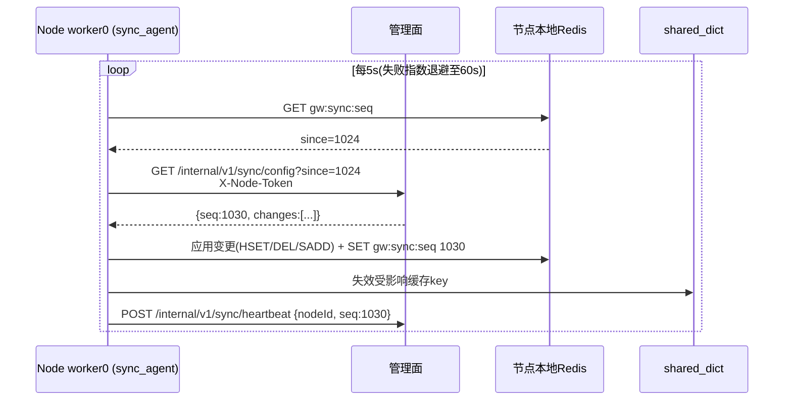
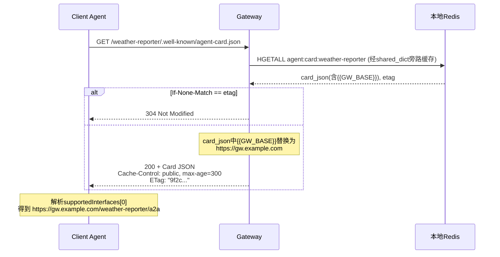
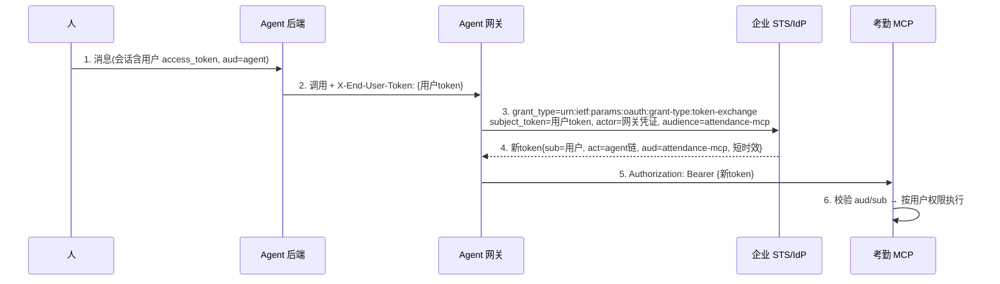

# Agent Gateway 详细设计文档

> 版本：V3.0（对齐 A2A Protocol v1.0.0）
> 前置文档：《设计文档.md》（V2 粗粒度方案）
> 本文档是代码开发前的完整设计基线，所有模块划分、数据结构、接口契约、流程时序以本文档为准。

---

## 目录

1. [概述](#1-概述)
2. [A2A v1.0.0 协议要点摘要](#2-a2a-v100-协议要点摘要)
3. [总体架构](#3-总体架构)
4. [核心数据模型](#4-核心数据模型)
5. [管理面详细设计](#5-管理面详细设计)
6. [数据面详细设计](#6-数据面详细设计)
7. [认证与安全设计](#7-认证与安全设计)
8. [配置同步详细设计](#8-配置同步详细设计)
9. [核心流程时序](#9-核心流程时序)
10. [错误处理设计](#10-错误处理设计)
11. [可观测性设计](#11-可观测性设计)
12. [非功能性设计](#12-非功能性设计)
13. [前端设计](#13-前端设计)
14. [测试策略与开发任务拆解](#14-测试策略与开发任务拆解)
15. [附录](#15-附录)

---

## 1. 概述

### 1.1 设计目标

构建一个高可用、可水平扩展的 Agent-to-Agent (A2A) 通信网关，作为企业内部 Agent 生态的统一入口，提供：

| 能力 | 说明 |
|---|---|
| Agent Card 托管与发现 | 为每个接入的 Agent 托管符合 A2A v1.0.0 规范的 Card，对外暴露路径式发现端点，并将 `url` 重写为网关代理地址 |
| 双向认证代理 | 第一跳：校验 Client Agent 的网关凭证 + 按 Agent 授权（ACL）；第二跳：代换上游 Server Agent 所需的真实凭证 |
| 协议透传 | A2A JSON-RPC 2.0 over HTTP 透传，SSE（Server-Sent Events）流式响应实时透传 |
| 配置下发 | 管理面统一维护配置，数据面节点通过轮询拉取实现最终一致 |

### 1.2 设计原则

1. **透传为主、轻量校验**：数据面只解析 JSON-RPC 信封（`jsonrpc`/`id`/`method`），用于路由决策与能力校验；**不深解析** Message/Task/Part 等业务载荷，保证协议未来演进时网关无需改造。
2. **声明与凭证分离**：Agent Card 中的 `securitySchemes` 是对外声明（不含秘密）；上游真实凭证单独加密存储，永不出现在 Card 与管理面读取接口中。
3. **数据面无状态**：运行时状态全部在节点本地 Redis + worker 共享内存（shared_dict），节点可随时增减。
4. **最终一致**：配置采用"管理面落库 → 节点轮询拉取"模型，容忍秒级延迟，换取架构简单与节点自治。
5. **失败收敛**：所有异常路径都映射为规范的 JSON-RPC 错误响应，不向调用方泄露内部拓扑与凭证信息。

### 1.3 范围

- **包含**：管理面（Spring Boot）、数据面（OpenResty + Lua + 本地 Redis）、前端控制台、配置同步机制、两跳认证、SSE 透传。
- **不包含**：gRPC / HTTP+JSON REST 绑定的代理（仅代理 JSONRPC 绑定）；Push Notification 的 webhook 中继（webhook 由 Client 与上游直接交互，网关仅透传推送配置类方法）；任务状态存储（网关不存 Task）。

### 1.4 术语表

| 术语 | 含义 |
|---|---|
| A2A | Agent2Agent 协议，本文档特指 v1.0.0 版本 |
| Agent Card | Agent 的自描述 JSON 文档（A2A 规范 4.4.1） |
| Client Agent / 调用方 | 发起 A2A 请求的一方 |
| Server Agent / 上游 | 被代理的真实 A2A 服务端 |
| 管理面 | Spring Boot 应用，负责配置 CRUD、发布、同步 API |
| 数据面 | OpenResty 节点集群，负责 Card 托管与请求代理 |
| 节点 | 一个 OpenResty 实例 + 同机本地 Redis 的组合 |
| ACL | 调用方到 Agent 的访问授权关系 |
| 版本水位 (seq) | 管理面 `config_change_log` 表的自增序号，用于增量同步 |

---

## 2. A2A v1.0.0 协议要点摘要

> 本章只摘录与网关设计直接相关的协议内容，作为后续章节的依据。完整内容见 <https://a2a-protocol.org/v1.0.0/specification>。

### 2.1 网关感知的协议面

网关是 **Card 托管方 + 透明代理**，需要感知的协议内容：

| 协议面 | 网关行为 |
|---|---|
| Agent Card（4.4.1） | 托管、按规范拼装、`supportedInterfaces` 重写为网关地址 |
| Well-Known URI（第 8 章） | 标准路径为 `/.well-known/agent-card.json`；本设计采用路径式 per-Agent 变体（见 3.3） |
| Card 缓存（8.6） | Card 端点 **SHOULD** 返回 `Cache-Control: max-age` 与 `ETag`，网关实现条件请求（304） |
| JSON-RPC 方法名（9.4） | PascalCase：`SendMessage`、`SendStreamingMessage`、`GetTask`、`ListTasks`、`CancelTask`、`SubscribeToTask`、`CreateTaskPushNotificationConfig`、`GetTaskPushNotificationConfig`、`ListTaskPushNotificationConfigs`、`DeleteTaskPushNotificationConfig`、`GetExtendedAgentCard` |
| SSE 格式（9.4.2） | 每条 `data:` 行是一个**完整 JSON-RPC 2.0 响应对象**，`result` 内嵌 StreamResponse（`task`/`message`/`statusUpdate`/`artifactUpdate` 四选一） |
| `A2A-Version` 头（3.6/14.2） | 客户端每请求必带，格式 `Major.Minor`；**空值按 0.3 解释**；网关原样透传给上游，由上游做版本协商 |
| `A2A-Extensions` 头 | 逗号分隔扩展 URI 列表，网关原样透传 |
| 错误码（5.4/9.5） | 标准 JSON-RPC 错误 + A2A 特定错误 `-32001`~`-32009`；网关自身错误使用自定义码（见第 10 章） |
| `tenant` 字段（4.4.6） | 本设计不启用多租户路由，重写后的 AgentInterface 不设置 `tenant` |

### 2.2 AgentCard v1.0.0 字段（与旧版差异）

v1.0.0 相对旧版的关键变化（原《设计文档.md》基于旧版，本文档已全部修正）：

| 旧版概念 | v1.0.0 形态 |
|---|---|
| 顶层 `url` + `preferredTransport` + `additionalInterfaces` | 合并为 `supportedInterfaces` 数组（AgentInterface：`url`/`protocolBinding`/`protocolVersion`/`tenant`，**第一项即首选**） |
| 顶层 `protocolVersion` | 移至每个 AgentInterface 内 |
| `security` | 改名 `securityRequirements` |
| `supportsAuthenticatedExtendedCard` | 移至 `capabilities.extendedAgentCard` |
| `message/send` 等 slash 方法名 | PascalCase：`SendMessage` 等 |
| 多态对象的 `kind` 判别字段 | 已移除，改用成员名包装（如 `{"statusUpdate": {...}}`） |
| well-known `agent.json` | `/.well-known/agent-card.json` |

### 2.3 v1.0.0 AgentCard 完整字段表

| 字段 | 类型 | 必填 | 说明 |
|---|---|---|---|
| `name` | string | 是 | 人类可读名称 |
| `description` | string | 是 | 描述 |
| `supportedInterfaces` | AgentInterface[] | 是 | 有序列表，第一项为首选 |
| `provider` | AgentProvider | 否 | `{organization, url}` |
| `version` | string | 是 | Agent 自身版本，如 `1.2.0` |
| `documentationUrl` | string | 否 | 文档地址 |
| `iconUrl` | string | 否 | 图标地址 |
| `capabilities` | AgentCapabilities | 是 | `{streaming, pushNotifications, extendedAgentCard, extensions[]}` |
| `securitySchemes` | map&lt;string, SecurityScheme&gt; | 否 | OpenAPI 风格方案声明（五选一判别联合：`apiKeySecurityScheme`/`httpAuthSecurityScheme`/`oauth2SecurityScheme`/`openIdConnectSecurityScheme`/`mtlsSecurityScheme`） |
| `securityRequirements` | array | 否 | 应用哪些方案，如 `[{"schemes":{"google":{"list":["openid","profile"]}}}]` |
| `defaultInputModes` | string[] | 是 | 默认输入媒体类型 |
| `defaultOutputModes` | string[] | 是 | 默认输出媒体类型 |
| `skills` | AgentSkill[] | 是 | 技能集合，每项含 `id`/`name`/`description`/`tags`（必填）+ `examples`/`inputModes`/`outputModes`/`securityRequirements`（可选） |
| `signatures` | AgentCardSignature[] | 否 | JWS 签名（本设计一期不生成、原样透传上游声明） |

---

## 3. 总体架构

### 3.1 部署拓扑



### 3.2 组件清单

| 组件 | 技术 | 职责 | 部署 |
|---|---|---|---|
| 控制台前端 | React + Ant Design Pro | Agent/调用方/ACL 管理、Card 预览、同步状态看板 | 静态资源，由管理面或 Nginx 托管 |
| 管理面 API | Spring Boot 3.x + MyBatis-Plus | 配置 CRUD、发布、同步 API、凭证加解密 | 2 实例 + LB（管理流量小，可单实例起步） |
| 数据库 | MySQL 8 | 全量配置存储、配置变更日志（版本水位） | 主库单点起步，可扩展主从 |
| 数据面节点 | OpenResty 1.25+ / Lua | Card 托管、认证、代理、SSE 透传、配置拉取 | N 节点，无状态，LB 轮询 |
| 本地 Redis | Redis 7 | 节点级运行时配置缓存 | 每节点 1 个，绑定 127.0.0.1 |

### 3.3 域名与端点规划

| 端点 | 路径 | 说明 |
|---|---|---|
| 数据面（对外） | `https://gw.example.com/{agentId}/.well-known/agent-card.json` | Agent Card 发现端点（GET） |
| 数据面（对外） | `https://gw.example.com/{agentId}/a2a` | A2A JSON-RPC 代理入口（POST） |
| 数据面（对内） | `http://127.0.0.1:8080/statusz` | 节点健康与同步水位（LB 健康检查 + 看板采集） |
| 管理面（对内） | `https://admin-gw.example.com/api/v1/**` | 控制台 API |
| 管理面（节点同步） | `https://admin-gw.example.com/internal/v1/sync/config` | 节点配置拉取 API |

**路径式 per-Agent 发现端点说明**：A2A 标准的 well-known 路径假设一个域名单 Agent。本网关单域名托管多 Agent，采用 `/{agentId}/.well-known/agent-card.json` 变体——每个 Agent 拥有独立且符合 well-known 形态的发现路径，Client 获取该 URL 后即可按标准流程使用（先取 Card，Card 内 `url` 指向同前缀下的 `/a2a` 代理入口）。

`agentId` 命名约束：正则 `^[a-z0-9][a-z0-9-]{1,62}$`（小写字母/数字/连字符，避免 Lua 模式匹配 `%w` 不匹配连字符的问题）。

### 3.4 两跳认证模型总览

```
Client Agent                      Gateway (数据面)                 Server Agent
     |                                  |                              |
     | 1. X-API-Key: gw-key-xxx         |                              |
     |---------------------------------->| 校验调用方凭证 + ACL          |
     |                                  | 代换上游凭证                  |
     |                                  | 2. Authorization: Bearer yyy |
     |                                  |----------------------------->|
```

- **第一跳（Client → Gateway）**：网关在管理面签发 API Key，数据面校验 Key 有效性及"该调用方是否被授权访问目标 Agent"。客户端 API Key **绝不转发给上游**。
- **第二跳（Gateway → Server Agent）**：网关按该 Agent 配置的上游认证方案（apiKey / Bearer / Basic / OAuth2 Client Credentials / mTLS）注入真实凭证。详见第 7 章。

---

## 4. 核心数据模型

### 4.1 MySQL 表结构（管理面，全量配置）

共 6 张表。字符集统一 `utf8mb4`，引擎 InnoDB。

#### 4.1.1 `agent_card` — Agent Card 完整定义

```sql
CREATE TABLE `agent_card` (
  `id`                   varchar(64)  NOT NULL COMMENT 'Agent唯一标识，正则 ^[a-z0-9][a-z0-9-]{1,62}$',
  `name`                 varchar(128) NOT NULL COMMENT 'Agent名称',
  `description`          text         COMMENT 'Agent描述',
  `provider_organization` varchar(256) DEFAULT NULL COMMENT '提供方组织名',
  `provider_url`         varchar(512)  DEFAULT NULL COMMENT '提供方网址',
  `version`              varchar(32)  NOT NULL COMMENT 'Agent版本，如 1.2.0',
  `documentation_url`    varchar(512)  DEFAULT NULL COMMENT '文档地址',
  `icon_url`             varchar(512)  DEFAULT NULL COMMENT '图标地址',
  `protocol_version`     varchar(8)   NOT NULL DEFAULT '1.0' COMMENT '上游声明的A2A协议版本(Major.Minor)',
  `endpoint_url`         varchar(512) NOT NULL COMMENT '上游真实A2A端点(内部，不出现在对外Card中)',
  `capabilities`         json         NOT NULL COMMENT 'AgentCapabilities: {streaming,pushNotifications,extendedAgentCard,extensions[]}',
  `security_schemes`     json          DEFAULT NULL COMMENT '对外声明的安全方案(不含秘密)',
  `security_requirements` json         DEFAULT NULL COMMENT '安全要求声明',
  `default_input_modes`  json         NOT NULL COMMENT '默认输入媒体类型数组',
  `default_output_modes` json         NOT NULL COMMENT '默认输出媒体类型数组',
  `skills`               json         NOT NULL COMMENT 'AgentSkill数组',
  `signatures`           json          DEFAULT NULL COMMENT 'Card JWS签名(一期原样透传)',
  `status`               tinyint      NOT NULL DEFAULT 1 COMMENT '1:启用 0:禁用(禁用视为未发布)',
  `published_seq`        bigint        DEFAULT NULL COMMENT '最近一次发布对应的config_change_log.seq; NULL=从未发布',
  `created_at`           datetime     NOT NULL DEFAULT CURRENT_TIMESTAMP,
  `updated_at`           datetime     NOT NULL DEFAULT CURRENT_TIMESTAMP ON UPDATE CURRENT_TIMESTAMP,
  PRIMARY KEY (`id`)
) ENGINE=InnoDB DEFAULT CHARSET=utf8mb4 COMMENT='Agent Card全量定义';
```

设计说明：
- 与 V2 文档相比，删除了旧版 `schema_version`/`url`/`security` 字段；新增 `protocol_version`（用于重写 `supportedInterfaces` 时声明版本）、`published_seq`（支撑"修改后未发布"状态判断）。
- 上游原始的 `supportedInterfaces` 不落库——对外 Card 中的 `supportedInterfaces` 由网关在发布时**生成**（见 5.4），仅含网关代理入口一个元素。

#### 4.1.2 `upstream_credential` — 上游凭证（加密存储）

```sql
CREATE TABLE `upstream_credential` (
  `id`          bigint       NOT NULL AUTO_INCREMENT,
  `agent_id`    varchar(64)  NOT NULL COMMENT '关联agent_card.id',
  `auth_type`   varchar(32)  NOT NULL COMMENT 'NONE|API_KEY|HTTP_BEARER|HTTP_BASIC|OAUTH2_CLIENT_CREDENTIALS|MTLS',
  `config_enc`  text         COMMENT 'AES-256-GCM加密后的认证配置JSON, 明文结构见7.3节',
  `created_at`  datetime     NOT NULL DEFAULT CURRENT_TIMESTAMP,
  `updated_at`  datetime     NOT NULL DEFAULT CURRENT_TIMESTAMP ON UPDATE CURRENT_TIMESTAMP,
  PRIMARY KEY (`id`),
  UNIQUE KEY `uk_agent_id` (`agent_id`)
) ENGINE=InnoDB DEFAULT CHARSET=utf8mb4 COMMENT='上游Server Agent认证凭证(加密)';
```

#### 4.1.3 `caller` — 调用方

```sql
CREATE TABLE `caller` (
  `id`          varchar(64)  NOT NULL COMMENT '调用方唯一标识',
  `name`        varchar(128) NOT NULL COMMENT '调用方名称',
  `description` varchar(512)  DEFAULT NULL,
  `status`      tinyint      NOT NULL DEFAULT 1 COMMENT '1:启用 0:禁用',
  `created_at`  datetime     NOT NULL DEFAULT CURRENT_TIMESTAMP,
  `updated_at`  datetime     NOT NULL DEFAULT CURRENT_TIMESTAMP ON UPDATE CURRENT_TIMESTAMP,
  PRIMARY KEY (`id`)
) ENGINE=InnoDB DEFAULT CHARSET=utf8mb4 COMMENT='Client Agent调用方';
```

#### 4.1.4 `caller_credential` — 调用方 API Key

```sql
CREATE TABLE `caller_credential` (
  `id`             bigint      NOT NULL AUTO_INCREMENT,
  `caller_id`      varchar(64) NOT NULL,
  `key_name`       varchar(64) NOT NULL COMMENT 'Key备注名',
  `api_key_prefix` varchar(16) NOT NULL COMMENT 'Key前8位, 用于日志与界面识别(如 gwk_a1b2c3d4)',
  `api_key_hash`   char(64)    NOT NULL COMMENT 'SHA-256(API Key)十六进制, 明文不落库',
  `status`         tinyint     NOT NULL DEFAULT 1 COMMENT '1:启用 0:吊销',
  `expires_at`     datetime     DEFAULT NULL COMMENT '过期时间, NULL=永不过期',
  `created_at`     datetime    NOT NULL DEFAULT CURRENT_TIMESTAMP,
  PRIMARY KEY (`id`),
  UNIQUE KEY `uk_key_hash` (`api_key_hash`),
  KEY `idx_caller` (`caller_id`)
) ENGINE=InnoDB DEFAULT CHARSET=utf8mb4 COMMENT='调用方API Key(仅存哈希)';
```

API Key 格式：`gwk_` + 40 位随机十六进制（共 44 字符）。明文仅在创建时返回一次。

#### 4.1.5 `caller_agent_acl` — 调用方授权

```sql
CREATE TABLE `caller_agent_acl` (
  `id`         bigint      NOT NULL AUTO_INCREMENT,
  `caller_id`  varchar(64) NOT NULL,
  `agent_id`   varchar(64) NOT NULL,
  `created_at` datetime    NOT NULL DEFAULT CURRENT_TIMESTAMP,
  PRIMARY KEY (`id`),
  UNIQUE KEY `uk_caller_agent` (`caller_id`, `agent_id`)
) ENGINE=InnoDB DEFAULT CHARSET=utf8mb4 COMMENT='调用方可访问的Agent白名单';
```

#### 4.1.6 `config_change_log` — 配置变更日志（同步版本水位）

```sql
CREATE TABLE `config_change_log` (
  `seq`         bigint      NOT NULL AUTO_INCREMENT COMMENT '全局递增版本号(同步水位)',
  `entity_type` varchar(16) NOT NULL COMMENT 'AGENT|UPSTREAM_CRED|CALLER|CALLER_CRED|ACL',
  `entity_id`   varchar(128) NOT NULL COMMENT '实体标识: agent_id / caller_id / key_hash 等',
  `operation`   varchar(8)  NOT NULL COMMENT 'UPSERT|DELETE',
  `changed_at`  datetime    NOT NULL DEFAULT CURRENT_TIMESTAMP,
  PRIMARY KEY (`seq`),
  KEY `idx_entity` (`entity_type`, `entity_id`)
) ENGINE=InnoDB DEFAULT CHARSET=utf8mb4 COMMENT='配置变更流水, 节点增量同步依据';
```

**保留策略**：定时任务每日清理，保留最近 7 天或最近 100000 行（取大者）。节点 `since` 早于最小保留 `seq` 时触发全量同步（见 8.3）。

### 4.2 Redis 数据结构（数据面，节点本地）

| Key | 类型 | 内容 | 写入方 |
|---|---|---|---|
| `agent:card:{agentId}` | Hash | 运行时 Agent 配置（字段见下） | sync_agent |
| `gw:caller:{apiKeyHash}` | Hash | `{caller_id, caller_name, caller_status, key_status, expires_at}` | sync_agent |
| `gw:acl:{callerId}` | Set | 授权的 agent_id 集合 | sync_agent |
| `gw:sync:seq` | String | 本节点已应用的版本水位 | sync_agent |
| `gw:oauth2:token:{agentId}` | String | 上游 OAuth2 token 缓存 `{"access_token":"...","expires_at":...}` | auth_upstream（运行时自管理） |

`agent:card:{agentId}` Hash 字段：

| Field | 说明 |
|---|---|
| `card_json` | 发布时预拼装的**完整对外 Card JSON** 字符串，其中网关地址以占位符 `{{GW_BASE}}` 表示（服务时字符串替换，见 6.4） |
| `etag` | Card 内容哈希（短 SHA-256），用于 HTTP 条件请求 |
| `endpoint_url` | 上游真实 A2A 端点 |
| `upstream_auth_type` | `NONE/API_KEY/HTTP_BEARER/HTTP_BASIC/OAUTH2_CLIENT_CREDENTIALS/MTLS` |
| `upstream_auth_config` | 上游认证配置明文 JSON（仅存在于节点本地 Redis，不落日志） |
| `capabilities` | capabilities JSON 字符串（能力校验用） |

### 4.3 shared_dict 缓存（worker 共享内存）

| Zone | 大小 | Key | Value | TTL |
|---|---|---|---|---|
| `agent_cache` | 10m | `agent:{agentId}` | cjson 编码的 agent 配置 table | 60s |
| `caller_cache` | 10m | `caller:{apiKeyHash}` | cjson 编码的 `{caller_id,status,acl[]}` | 60s |

缓存策略：**旁路缓存**——读路径未命中时回源本地 Redis；sync_agent 应用变更后主动 `delete` 对应 key 实现秒级失效；TTL 60s 作为兜底（容忍旧数据最长 60s 的极端场景：变更日志正常但主动失效失败）。

---

## 5. 管理面详细设计

### 5.1 技术栈与工程结构

- Java 17、Spring Boot 3.2、MyBatis-Plus 3.5.x、MySQL 8（测试用 H2 MySQL 模式）、Maven（无 wrapper，使用系统 `mvn`）、springdoc-openapi（接口文档）。
- 包结构：

```
com.agentgateway
├── AgentGatewayApplication.java
├── common/
│   ├── Result.java                  # 统一响应体 {code, message, data}
│   ├── ErrorCode.java               # 管理面业务错误码枚举
│   ├── BizException.java
│   └── GlobalExceptionHandler.java  # @RestControllerAdvice
├── config/
│   ├── MybatisPlusConfig.java       # 分页插件
│   ├── CryptoConfig.java            # AES-GCM 密钥装配(从环境变量读取)
│   └── WebConfig.java               # CORS、管理面Token拦截器注册
├── controller/
│   ├── AgentController.java         # /api/v1/agents
│   ├── CallerController.java        # /api/v1/callers
│   ├── DashboardController.java     # /api/v1/dashboard
│   └── SyncController.java          # /internal/v1/sync (节点专用)
├── service/
│   ├── AgentService.java / impl
│   ├── PublishService.java / impl   # 发布与Card拼装
│   ├── CallerService.java / impl
│   ├── SyncService.java / impl      # 增量/全量同步查询
│   └── CryptoService.java           # AES-256-GCM 加解密
├── mapper/                          # MyBatis-Plus BaseMapper, 6个
├── entity/                          # 6个表实体
└── dto/
    ├── request/                     # 含jakarta.validation注解
    └── response/
```

### 5.2 管理面自身认证（一期简化方案）

- 单管理员 Token：配置文件 `gateway.admin-token`（环境变量注入，默认值空则拒绝一切请求）。
- 前端登录页输入 Token，存 `localStorage`，所有 `/api/**` 请求携带 `Authorization: Bearer {token}`。
- `AdminAuthInterceptor` 校验；`/internal/**` 走独立的节点 Token 校验（见 8.4）。
- 后续可平滑替换为 Spring Security + RBAC，不影响业务代码。

### 5.3 统一响应体与错误码

```json
{ "code": 0, "message": "ok", "data": { } }
```

| code | 含义 |
|---|---|
| 0 | 成功 |
| 40001 | 参数校验失败（message 含字段明细） |
| 40101 | 未认证 / Token 无效 |
| 40401 | 资源不存在 |
| 40901 | 冲突（如 agent_id 已存在、Key 已吊销） |
| 50000 | 服务器内部错误 |

### 5.4 API 接口清单

#### 5.4.1 Agent 管理 `/api/v1/agents`

| 方法 | 路径 | 说明 |
|---|---|---|
| POST | `/api/v1/agents` | 创建 Agent Card |
| PUT | `/api/v1/agents/{id}` | 更新 Agent Card |
| GET | `/api/v1/agents?page=&size=&keyword=&status=` | 分页列表（返回字段含 `published` 布尔：`published_seq != null && published_seq >= 最近变更seq`，由 JOIN 变更日志判断"有未发布修改"） |
| GET | `/api/v1/agents/{id}` | 详情（**不含**上游凭证明文，仅返回 `upstreamAuthType` 与掩码后的标识信息） |
| DELETE | `/api/v1/agents/{id}` | 删除（同事务写入 DELETE 变更日志，节点将移除运行时配置） |
| GET | `/api/v1/agents/{id}/card-preview` | 返回该 Agent 对外暴露的完整 Card JSON（占位符已替换为配置的网关 Base URL），供前端预览与调试 |
| POST | `/api/v1/agents/{id}/publish` | 发布：校验 + 拼装运行时配置 + 写变更日志 |
| POST | `/api/v1/agents/{id}/unpublish` | 下线：写 DELETE 变更日志 |
| PUT | `/api/v1/agents/{id}/upstream-credential` | 设置/更新上游凭证（加密入库；发布时随 Agent 一并下发） |
| DELETE | `/api/v1/agents/{id}/upstream-credential` | 清除上游凭证（等价于 auth_type=NONE） |

**创建/更新请求体**（字段与表结构一一对应，JSON 字段直接透传嵌套结构）：

```json
{
  "id": "weather-reporter",
  "name": "Weather Reporter",
  "description": "提供天气查询与播报能力",
  "provider": { "organization": "Example Corp", "url": "https://example.com" },
  "version": "1.2.0",
  "documentationUrl": "https://docs.example.com/weather",
  "iconUrl": "https://example.com/icon.png",
  "protocolVersion": "1.0",
  "endpointUrl": "https://weather-agent.internal/a2a/v1",
  "capabilities": { "streaming": true, "pushNotifications": false, "extendedAgentCard": false },
  "securitySchemes": {
    "gateway-key": { "apiKeySecurityScheme": { "location": "header", "name": "X-API-Key" } }
  },
  "securityRequirements": [{ "schemes": { "gateway-key": { "list": [] } } }],
  "defaultInputModes": ["text/plain"],
  "defaultOutputModes": ["text/plain", "application/json"],
  "skills": [
    {
      "id": "weather-query",
      "name": "天气查询",
      "description": "按城市查询实时天气",
      "tags": ["weather", "query"],
      "examples": ["北京今天天气如何"]
    }
  ],
  "status": 1
}
```

**上游凭证请求体**（`PUT .../upstream-credential`）：

```json
{
  "authType": "OAUTH2_CLIENT_CREDENTIALS",
  "config": {
    "tokenUrl": "https://auth.internal/oauth/token",
    "clientId": "gateway-client",
    "clientSecret": "xxxx",
    "scopes": ["a2a"]
  }
}
```

#### 5.4.2 调用方管理 `/api/v1/callers`

| 方法 | 路径 | 说明 |
|---|---|---|
| POST | `/api/v1/callers` | 创建调用方 |
| PUT | `/api/v1/callers/{id}` | 更新（名称/描述/状态；禁用后其所有 Key 立即失效） |
| GET | `/api/v1/callers?page=&size=` | 分页列表 |
| DELETE | `/api/v1/callers/{id}` | 删除（级联删除其 Key 与 ACL，写变更日志） |
| POST | `/api/v1/callers/{id}/credentials` | 生成 API Key，**明文仅本响应返回一次**：`{"apiKey":"gwk_xxx...","prefix":"gwk_a1b2c3d4"}` |
| DELETE | `/api/v1/callers/{id}/credentials/{credId}` | 吊销 Key |
| PUT | `/api/v1/callers/{id}/acl` | 全量替换授权集合：`{"agentIds":["weather-reporter","translator"]}` |
| GET | `/api/v1/callers/{id}/acl` | 查询授权集合 |

#### 5.4.3 看板 `/api/v1/dashboard`

| 方法 | 路径 | 说明 |
|---|---|---|
| GET | `/api/v1/dashboard/sync-watermark` | 当前最大 `seq`、各 Agent 发布状态统计 |
| GET | `/api/v1/dashboard/nodes` | 节点心跳列表（nodeId、已同步 seq、最近心跳时间；心跳由节点上报，见 8.5） |
| GET | `/api/v1/dashboard/changes?page=&size=` | 变更日志流水 |

#### 5.4.4 节点同步 API（详见第 8 章）

| 方法 | 路径 | 说明 |
|---|---|---|
| GET | `/internal/v1/sync/config?since={seq}` | 增量/全量配置拉取 |
| POST | `/internal/v1/sync/heartbeat` | 节点心跳上报 `{nodeId, seq, redisOk}` |

### 5.5 Card 字段校验规则（创建/更新/发布时执行）

| 规则 | 校验点 |
|---|---|
| `id` 匹配 `^[a-z0-9][a-z0-9-]{1,62}$` | 创建时 |
| `name`/`version`/`endpointUrl`/`capabilities`/`skills`/`defaultInputModes`/`defaultOutputModes` 非空 | 创建/更新 |
| `endpointUrl` 必须是合法 http/https URL | 创建/更新 |
| `capabilities` 仅允许 `streaming`/`pushNotifications`/`extendedAgentCard`/`extensions` 键 | 创建/更新 |
| 每个 skill 必填 `id`/`name`/`description`/`tags`，skill id 在 Agent 内唯一 | 创建/更新 |
| `securitySchemes` 每个方案必须恰好含五种判别字段之一；`securityRequirements` 引用的方案名必须已声明 | 创建/更新 |
| `defaultInputModes`/`defaultOutputModes` 每项必须是合法媒体类型格式 `type/subtype` | 创建/更新 |
| 发布前置：`status=1`；若 `capabilities.streaming=false`，仅提示（不阻断，运行时对流式方法快速失败） | 发布时 |

### 5.6 发布流程（PublishService）

```java
@Transactional
public long publishAgentCard(String agentId) {
    // 1. 查询并校验
    AgentCard card = agentMapper.selectById(agentId);
    if (card == null) throw new BizException(40401, "agent not found");
    validateForPublish(card);

    // 2. 拼装对外 Card JSON（含 {{GW_BASE}} 占位符）
    String cardJson = buildPublicCardJson(card);   // 见下方结构
    String etag = DigestUtils.sha256Hex(cardJson).substring(0, 16);

    // 3. 写变更日志: AGENT UPSERT（payload在同步时实时组装, 日志只记事件）
    ConfigChangeLog agentChange = changeLogMapper.insert(
        new ConfigChangeLog("AGENT", agentId, "UPSERT"));

    // 4. 若存在上游凭证, 写 UPSTREAM_CRED UPSERT
    UpstreamCredential cred = credentialMapper.selectByAgentId(agentId);
    if (cred != null) {
        changeLogMapper.insert(new ConfigChangeLog("UPSTREAM_CRED", agentId, "UPSERT"));
    }

    // 5. 更新 published_seq 与 etag 冗余列(便于列表页展示)
    agentMapper.updatePublishedSeq(agentId, agentChange.getSeq(), etag);
    return agentChange.getSeq();
}
```

**`buildPublicCardJson` 输出结构**（同步 API 原样下发，节点服务时仅替换 `{{GW_BASE}}`）：

```json
{
  "name": "Weather Reporter",
  "description": "...",
  "supportedInterfaces": [
    { "url": "{{GW_BASE}}/weather-reporter/a2a", "protocolBinding": "JSONRPC", "protocolVersion": "1.0" }
  ],
  "provider": { "organization": "Example Corp", "url": "https://example.com" },
  "version": "1.2.0",
  "documentationUrl": "https://docs.example.com/weather",
  "iconUrl": "https://example.com/icon.png",
  "capabilities": { "streaming": true, "pushNotifications": false, "extendedAgentCard": false },
  "securitySchemes": {
    "gateway-key": { "apiKeySecurityScheme": { "location": "header", "name": "X-API-Key" } }
  },
  "securityRequirements": [{ "schemes": { "gateway-key": { "list": [] } } }],
  "defaultInputModes": ["text/plain"],
  "defaultOutputModes": ["text/plain", "application/json"],
  "skills": [ ... ]
}
```

要点：
- `supportedInterfaces` 由网关**生成**，仅含一个 JSONRPC 入口，URL 指向自身代理端点；`endpoint_url`（上游真实地址）**不出现**在对外 Card 中。
- 对外 Card 中的 `securitySchemes` 声明的是**第一跳（Client→Gateway）** 的认证方式（网关统一为 header `X-API-Key`），由管理面在拼装时替换/生成——运营人员录入的 `securitySchemes` 若描述的是上游认证，则不对外暴露；对外声明固定注入网关自身的 API Key 方案（可在管理面配置方案名，默认 `gateway-key`）。
- `signatures`：一期不做网关重签名。由于 URL 被重写，上游原始签名必然失效，发布时**移除** `signatures` 字段并在响应头 `X-Gateway-Card-Rewritten: true` 标识（二期可支持网关私钥 JWS 重签名）。

### 5.7 凭证加密（CryptoService）

- 算法：AES-256-GCM，密钥 32 字节，从环境变量 `GATEWAY_CRED_KEY`（Base64）读取；启动时缺失则拒绝启动。
- 密文存储格式：Base64( IV(12B) ‖ ciphertext ‖ tag(16B) )。
- 解密仅发生在两个场景：① 同步 API 组装节点下发载荷；② 管理面"测试上游连通性"（二期）。任何日志、普通查询接口不输出明文。

---

## 6. 数据面详细设计

### 6.1 Nginx 配置

```nginx
# nginx.conf 关键片段
http {
    lua_package_path "/usr/local/openresty/site/lualib/?.lua;;";
    lua_shared_dict agent_cache  10m;
    lua_shared_dict caller_cache 10m;

    # 管理面地址(同步用), 生产建议走内部DNS
    init_by_lua_block {
        require("cjson")
    }
    init_worker_by_lua_block {
        local sync = require("a2a.sync_agent")
        sync.start()   -- 仅 worker 0 启动拉取循环, 见6.7
    }

    # upstream keepalive 由 lua-resty-http set_keepalive 管理

    log_format a2a_json escape=json
        '{"ts":"$time_iso8601","request_id":"$request_id","agent":"$a2a_agent_id",'
        '"caller":"$a2a_caller_id","rpc_method":"$a2a_rpc_method","status":$status,'
        '"bytes":$body_bytes_sent,"rt":$request_time,"upstream_rt":"$a2a_upstream_rt",'
        '"upstream_status":"$a2a_upstream_status","err":"$a2a_error_code"}';

    server {
        listen 443 ssl;
        server_name gw.example.com;
        # ssl_certificate / ssl_certificate_key 省略
        access_log /var/log/nginx/a2a_access.log a2a_json;

        # ---- 端点1: Agent Card 发现 ----
        location ~ ^/(?<agent_id>[a-z0-9][a-z0-9-]{1,62})/\.well-known/agent-card\.json$ {
            set $a2a_agent_id $agent_id;
            content_by_lua_block {
                require("a2a.card").serve_card(ngx.var.agent_id)
            }
        }

        # ---- 端点2: A2A 代理 ----
        location ~ ^/(?<agent_id>[a-z0-9][a-z0-9-]{1,62})/a2a/?$ {
            set $a2a_agent_id $agent_id;
            access_by_lua_block {
                require("a2a.auth_caller").authenticate(ngx.var.agent_id)
            }
            content_by_lua_block {
                require("a2a.proxy").handle_request(ngx.var.agent_id)
            }
        }

        # ---- 节点状态(仅本机/内网) ----
        location = /statusz {
            allow 127.0.0.1; allow 10.0.0.0/8; deny all;
            content_by_lua_block {
                require("a2a.sync_agent").statusz()
            }
        }
    }
}
```

### 6.2 Lua 模块总览

| 模块 | 文件 | 职责 |
|---|---|---|
| `a2a.util` | `lualib/a2a/util.lua` | JSON-RPC 错误构造与响应写出、trace id、日志变量设置 |
| `a2a.redis_client` | `lualib/a2a/redis_client.lua` | shared_dict + 本地 Redis 旁路读取 |
| `a2a.card` | `lualib/a2a/card.lua` | Card 托管端点（占位符替换、ETag/304） |
| `a2a.auth_caller` | `lualib/a2a/auth_caller.lua` | 第一跳：调用方 API Key 校验 + ACL |
| `a2a.auth_upstream` | `lualib/a2a/auth_upstream.lua` | 第二跳：上游凭证注入（含 OAuth2 token 缓存刷新） |
| `a2a.proxy` | `lualib/a2a/proxy.lua` | JSON-RPC 信封解析、能力校验、转发、SSE 透传 |
| `a2a.sync_agent` | `lualib/a2a/sync_agent.lua` | 定时轮询管理面、应用变更到本地 Redis、失效缓存、心跳上报 |

### 6.3 `a2a.redis_client` — 配置读取

```lua
local _M = {}
local cjson = require("cjson")
local redis = require("resty.redis")
local CACHE_TTL = 60  -- 秒, 兜底TTL; 主动失效由sync_agent执行

local function connect_redis()
    local red = redis:new()
    red:set_timeouts(500, 500, 500)          -- connect/send/read 均 500ms
    local ok, err = red:connect("127.0.0.1", 6379)
    if not ok then return nil, err end
    return red
end

-- 返回 table 或 nil
function _M.get_agent_config(agent_id)
    local cache = ngx.shared.agent_cache
    local ckey = "agent:" .. agent_id
    local cached = cache:get(ckey)
    if cached then return cjson.decode(cached) end

    local red, err = connect_redis()
    if not red then return nil, "redis: " .. (err or "?") end
    local res, err = red:hgetall("agent:card:" .. agent_id)
    red:set_keepalive(10000, 100)             -- 10s空闲, 池100
    if not res or #res == 0 then
        cache:set(ckey, "null", 10)           -- 短TTL负缓存, 防穿透
        return nil, "not_found"
    end
    local cfg = red:array_to_hash(res)        -- {card_json=..., endpoint_url=..., ...}
    cfg.capabilities = cjson.decode(cfg.capabilities or "{}")
    cfg.upstream_auth_config = cfg.upstream_auth_config  -- 保持字符串, 由auth_upstream解码
    cache:set(ckey, cjson.encode(cfg), CACHE_TTL)
    return cfg
end

-- 返回 {caller_id=..., status=..., acl={agentId=true,...}} 或 nil
function _M.get_caller_with_acl(api_key_hash)
    local cache = ngx.shared.caller_cache
    local ckey = "caller:" .. api_key_hash
    local cached = cache:get(ckey)
    if cached then
        if cached == "null" then return nil, "not_found" end
        return cjson.decode(cached)
    end

    local red, err = connect_redis()
    if not red then return nil, "redis: " .. (err or "?") end
    local cred = red:array_to_hash(red:hgetall("gw:caller:" .. api_key_hash))
    if not cred or not cred.caller_id then
        red:set_keepalive(10000, 100)
        cache:set(ckey, "null", 10)
        return nil, "not_found"
    end
    local members = red:smembers("gw:acl:" .. cred.caller_id)
    red:set_keepalive(10000, 100)
    local acl = {}
    for _, aid in ipairs(members) do acl[aid] = true end
    local info = {
        caller_id = cred.caller_id,
        status = tonumber(cred.caller_status) == 1 and tonumber(cred.key_status) == 1 and 1 or 0,
        expires_at = cred.expires_at,   -- "2026-08-01 00:00:00" 或空串
        acl = acl,
    }
    cache:set(ckey, cjson.encode(info), CACHE_TTL)
    return info
end
return _M
```

### 6.4 `a2a.card` — Card 托管与重写

```lua
local _M = {}
local rc = require("a2a.redis_client")
local util = require("a2a.util")

function _M.serve_card(agent_id)
    local cfg, err = rc.get_agent_config(agent_id)
    if not cfg then
        -- Card发现端点无需区分未授权: 一律404, 不泄露Agent存在性
        return util.json_error(404, nil, -32012, "Agent not found")
    end

    -- 条件请求: If-None-Match 命中则 304
    local inm = ngx.req.get_headers()["If-None-Match"]
    if inm and inm == '"' .. cfg.etag .. '"' then
        ngx.status = 304
        return ngx.exit(304)
    end

    -- 占位符替换: {{GW_BASE}} -> scheme://host (无JSON解析, 纯字符串替换)
    local gw_base = ngx.var.scheme .. "://" .. ngx.var.host
    local body = string.gsub(cfg.card_json, "{{GW_BASE}}", gw_base)

    ngx.header["Content-Type"] = "application/json"
    ngx.header["Cache-Control"] = "public, max-age=300"
    ngx.header["ETag"] = '"' .. cfg.etag .. '"'
    ngx.header["X-Gateway-Card-Rewritten"] = "true"
    ngx.print(body)
end
return _M
```

### 6.5 `a2a.auth_caller` — 第一跳认证

```lua
local _M = {}
local rc = require("a2a.redis_client")
local util = require("a2a.util")

function _M.authenticate(agent_id)
    -- 1. 提取并哈希 API Key
    local api_key = ngx.req.get_headers()["X-API-Key"]
    if not api_key or api_key == "" then
        return util.rpc_abort(401, -32010, "Missing API key")
    end
    local hash = ngx.sha256_bin and util.sha256_hex(api_key)  -- resty.sha256 封装

    -- 2. 查调用方 + ACL (先校验授权, 再查Agent配置 —— 403同时覆盖"未授权"与"Agent不存在", 防枚举)
    local info, err = rc.get_caller_with_acl(hash)
    if not info or info.status ~= 1 then
        return util.rpc_abort(401, -32010, "Invalid or revoked API key")
    end
    if info.expires_at and info.expires_at ~= "" and info.expires_at < ngx.utctime() then
        return util.rpc_abort(401, -32010, "API key expired")
    end
    if not info.acl[agent_id] then
        return util.rpc_abort(403, -32011, "Forbidden")
    end

    -- 3. 记录日志变量
    ngx.var.a2a_caller_id = info.caller_id

    -- 4. 擦除客户端凭证, 防泄漏到上游 (proxy模块重建header时也不会携带)
    ngx.req.set_header("X-API-Key", nil)
end
return _M
```

### 6.6 `a2a.auth_upstream` — 第二跳凭证代换

```lua
local _M = {}
local cjson = require("cjson")
local http = require("resty.http")

-- 返回需要注入到上游请求的 header 表
function _M.build_upstream_headers(agent_id, cfg)
    local t = cfg.upstream_auth_type
    if t == "NONE" or not t then return {} end
    local conf = cjson.decode(cfg.upstream_auth_config or "{}")

    if t == "API_KEY" then
        -- conf: {location="header"|"query", name="X-Api-Key", value="..."}
        if conf.location == "query" then
            return {}, conf.name .. "=" .. ngx.escape_uri(conf.value)  -- 拼到query
        end
        return { [conf.name] = conf.value }

    elseif t == "HTTP_BEARER" then
        return { ["Authorization"] = "Bearer " .. conf.token }

    elseif t == "HTTP_BASIC" then
        return { ["Authorization"] = "Basic " .. ngx.encode_base64(conf.username .. ":" .. conf.password) }

    elseif t == "OAUTH2_CLIENT_CREDENTIALS" then
        local token, err = _M.get_oauth2_token(agent_id, conf)
        if not token then return nil, err end
        return { ["Authorization"] = "Bearer " .. token }

    elseif t == "MTLS" then
        -- 由 stream/http ssl client certificate 配置承载, 无需注入header
        return {}
    end
    return {}
end

-- OAuth2 token: shared_dict缓存 + 提前30s刷新
function _M.get_oauth2_token(agent_id, conf)
    local cache = ngx.shared.agent_cache
    local tkey = "oauth2:" .. agent_id
    local cached = cache:get(tkey)
    if cached then
        local tk = cjson.decode(cached)
        if tk.expires_at - 30 > ngx.time() then return tk.access_token end
    end
    local httpc = http.new()
    httpc:set_timeouts(3000, 3000, 5000)
    local res, err = httpc:request_uri(conf.tokenUrl, {
        method = "POST",
        body = "grant_type=client_credentials&client_id=" .. ngx.escape_uri(conf.clientId)
             .. "&client_secret=" .. ngx.escape_uri(conf.clientSecret)
             .. (conf.scopes and "&scope=" .. ngx.escape_uri(table.concat(conf.scopes, " ")) or ""),
        headers = { ["Content-Type"] = "application/x-www-form-urlencoded" },
        ssl_verify = true,
    })
    if not res or res.status ~= 200 then return nil, "oauth2 token fetch failed" end
    local body = cjson.decode(res.body)
    local ttl = tonumber(body.expires_in) or 300
    cache:set(tkey, cjson.encode({
        access_token = body.access_token,
        expires_at = ngx.time() + ttl,
    }), ttl)
    return body.access_token
end
return _M
```

> 并发刷新 thundering herd：一期接受多 worker 并发回源（token endpoint 压力小）；二期可用 `resty.lock` 收敛。

### 6.7 `a2a.sync_agent` — 配置拉取（节点自治核心）

```lua
local _M = {}
local http = require("resty.http")
local cjson = require("cjson")
local redis = require("resty.redis")

local SYNC_INTERVAL = 5              -- 正常轮询间隔(秒)
local RETRY_MAX = 60                 -- 失败退避上限(秒)
local MGMT_URL = os.getenv("GATEWAY_MGMT_URL")           -- 如 https://admin-gw.example.com
local NODE_TOKEN = os.getenv("GATEWAY_NODE_TOKEN")       -- 节点凭证
local NODE_ID = os.getenv("GATEWAY_NODE_ID") or ngx.var.hostname

function _M.start()
    if ngx.worker.id() ~= 0 then return end   -- 仅 worker 0 执行; shared_dict 节点内共享
    ngx.timer.at(0, _M.sync_loop)
end

function _M.sync_loop(premature)
    if premature then return end
    local backoff = SYNC_INTERVAL
    local ok, err = pcall(_M.sync_once)
    if not ok then
        ngx.log(ngx.ERR, "sync failed: ", err)
        backoff = math.min((ngx.shared.agent_cache:get("sync:backoff") or SYNC_INTERVAL) * 2, RETRY_MAX)
        ngx.shared.agent_cache:set("sync:backoff", backoff)
    else
        ngx.shared.agent_cache:delete("sync:backoff")
    end
    ngx.timer.at(backoff, _M.sync_loop)
end

function _M.sync_once()
    local red = redis:new()
    red:set_timeouts(1000, 1000, 1000)
    assert(red:connect("127.0.0.1", 6379))
    local since = red:get("gw:sync:seq") or "0"

    local httpc = http.new()
    httpc:set_timeouts(3000, 3000, 10000)
    local res, err = httpc:request_uri(
        MGMT_URL .. "/internal/v1/sync/config?since=" .. since, {
        method = "GET",
        headers = { ["X-Node-Token"] = NODE_TOKEN },
        ssl_verify = true,
    })
    assert(res and res.status == 200, "sync api error: " .. tostring(err or (res and res.status)))

    local body = cjson.decode(res.body).data
    if body.fullSync then
        _M.apply_full(red, body.snapshot)         -- 全量重建, 见8.3
    else
        for _, ch in ipairs(body.changes or {}) do
            _M.apply_change(red, ch)               -- 写Redis + 失效shared_dict
        end
    end
    red:set("gw:sync:seq", body.seq)
    red:set("gw:sync:ts", ngx.time())
    red:set_keepalive(10000, 20)

    -- 心跳上报(失败仅记日志)
    local hb = http.new()
    hb:set_timeouts(2000, 2000, 3000)
    hb:request_uri(MGMT_URL .. "/internal/v1/sync/heartbeat", {
        method = "POST",
        body = cjson.encode({ nodeId = NODE_ID, seq = body.seq, redisOk = true }),
        headers = { ["X-Node-Token"] = NODE_TOKEN, ["Content-Type"] = "application/json" },
        ssl_verify = true,
    })
end

function _M.apply_change(red, ch)
    if ch.entityType == "AGENT" then
        if ch.operation == "DELETE" then
            red:del("agent:card:" .. ch.entityId)
        else
            local p = ch.payload
            red:hmset("agent:card:" .. ch.entityId,
                "card_json", p.cardJson, "etag", p.etag,
                "endpoint_url", p.endpointUrl,
                "upstream_auth_type", p.upstreamAuthType or "NONE",
                "upstream_auth_config", p.upstreamAuthConfig or "{}",
                "capabilities", p.capabilities)
        end
        ngx.shared.agent_cache:delete("agent:" .. ch.entityId)
        ngx.shared.agent_cache:delete("oauth2:" .. ch.entityId)

    elseif ch.entityType == "CALLER_CRED" then
        local p = ch.payload
        if ch.operation == "DELETE" then
            red:del("gw:caller:" .. ch.entityId)
        else
            red:hmset("gw:caller:" .. ch.entityId,
                "caller_id", p.callerId, "caller_name", p.callerName or "",
                "caller_status", p.callerStatus, "key_status", p.keyStatus,
                "expires_at", p.expiresAt or "")
        end
        ngx.shared.caller_cache:delete("caller:" .. ch.entityId)

    elseif ch.entityType == "ACL" then
        -- 全量替换该caller的ACL集合
        red:del("gw:acl:" .. ch.entityId)
        if ch.operation ~= "DELETE" and #(ch.payload.agentIds or {}) > 0 then
            red:sadd("gw:acl:" .. ch.entityId, unpack(ch.payload.agentIds))
        end
        ngx.shared.caller_cache:flush_all()   -- ACL嵌入在caller缓存中, 简单起见全清(量小)

    elseif ch.entityType == "CALLER" then
        -- 状态变化影响其所有Key: 由管理面同时下发每个CALLER_CRED变更, 此处仅兜底清缓存
        ngx.shared.caller_cache:flush_all()
    end
end

function _M.statusz()
    local red = redis:new()
    red:set_timeouts(500, 500, 500)
    local ok = red:connect("127.0.0.1", 6379)
    local seq = ok and red:get("gw:sync:seq") or nil
    ngx.header["Content-Type"] = "application/json"
    ngx.print(cjson.encode({
        nodeId = NODE_ID, redisOk = ok == 1 or ok == true,
        syncSeq = tonumber(seq) or 0,
        syncTs = ok and tonumber(red:get("gw:sync:ts")) or nil,
    }))
end
return _M
```

### 6.8 `a2a.proxy` — A2A 代理与 SSE 透传（核心模块）

> **关键修正（相对 V2 文档）**：`lua-resty-http` 的 `request_uri()` 会**缓冲完整响应体**，SSE 场景将永远阻塞；必须使用 `request()` 拿到 `res.body_reader` 逐块读取。

```lua
local _M = {}
local cjson = require("cjson")
local http = require("resty.http")
local rc = require("a2a.redis_client")
local auth_up = require("a2a.auth_upstream")
local util = require("a2a.util")

-- A2A v1.0.0 流式方法集合
local STREAM_METHODS = { SendStreamingMessage = true, SubscribeToTask = true }
-- 已知方法集合(仅用于能力校验与日志; 未知方法放行透传, 由上游返回-32601)
local KNOWN_METHODS = {
    SendMessage = true, SendStreamingMessage = true, GetTask = true, ListTasks = true,
    CancelTask = true, SubscribeToTask = true,
    CreateTaskPushNotificationConfig = true, GetTaskPushNotificationConfig = true,
    ListTaskPushNotificationConfigs = true, DeleteTaskPushNotificationConfig = true,
    GetExtendedAgentCard = true,
}

local CONNECT_TIMEOUT = 5000      -- 连接上游
local SEND_TIMEOUT    = 10000     -- 发送请求体
local READ_TIMEOUT    = 60000     -- 普通响应读取
local SSE_READ_TIMEOUT = 600000   -- 流式读取(10分钟, 覆盖长任务)

function _M.handle_request(agent_id)
    -- 0. 仅允许POST
    if ngx.req.get_method() ~= "POST" then
        return util.rpc_abort(405, -32600, "Method not allowed")
    end

    -- 1. 读取并解析JSON-RPC信封(仅解析信封字段, 不触碰params业务体)
    ngx.req.read_body()
    local body = ngx.req.get_body_data()
    if not body then return util.rpc_abort(400, -32600, "Empty body") end
    local ok, envelope = pcall(cjson.decode, body)
    if not ok or type(envelope) ~= "table" then
        return util.rpc_abort(400, -32700, "Parse error: invalid JSON")
    end
    local rpc_id = envelope.id       -- 可能为string/number/null
    local method = envelope.method
    if envelope.jsonrpc ~= "2.0" or type(method) ~= "string" then
        return util.rpc_abort(400, -32600, "Invalid Request", rpc_id)
    end
    ngx.var.a2a_rpc_method = method

    -- 2. 取Agent配置(此时调用方已过ACL, Agent必然已授权; 未发布则配置不存在)
    local cfg, err = rc.get_agent_config(agent_id)
    if not cfg then
        return util.rpc_abort(403, -32011, "Forbidden", rpc_id)   -- 与ACL失败同码, 防枚举
    end

    -- 3. 能力校验: 流式方法但上游未声明streaming -> 快速失败(-32004)
    if STREAM_METHODS[method] and not (cfg.capabilities and cfg.capabilities.streaming) then
        return util.rpc_abort(400, -32004,
            "Streaming is not supported by this agent", rpc_id)
    end

    -- 4. 组装上游请求头: 透传协议头 + 代换凭证, 剥离客户端凭证
    local up_headers, extra_query, herr = {}, nil, nil
    local auth_headers, auth_query_or_err = auth_up.build_upstream_headers(agent_id, cfg)
    if not auth_headers then
        return util.rpc_abort(502, -32013, "Upstream auth failed: " .. tostring(auth_query_or_err), rpc_id)
    end
    for k, v in pairs(auth_headers) do up_headers[k] = v end
    if type(auth_query_or_err) == "string" then extra_query = auth_query_or_err end
    up_headers["Content-Type"] = "application/json"
    up_headers["Accept"] = "application/json, text/event-stream"
    -- A2A协议头原样透传(版本协商由上游完成; 空A2A-Version上游按0.3处理)
    local req_h = ngx.req.get_headers()
    if req_h["A2A-Version"] then up_headers["A2A-Version"] = req_h["A2A-Version"] end
    if req_h["A2A-Extensions"] then up_headers["A2A-Extensions"] = req_h["A2A-Extensions"] end
    up_headers["X-Request-Id"] = ngx.var.request_id

    -- 5. 发起上游请求(流式API, 不缓冲body)
    local httpc = http.new()
    local is_stream_req = STREAM_METHODS[method] or false
    httpc:set_timeouts(CONNECT_TIMEOUT, SEND_TIMEOUT,
                       is_stream_req and SSE_READ_TIMEOUT or READ_TIMEOUT)
    local url = cfg.endpoint_url
    if extra_query then url = url .. (string.find(url, "?", 1, true) and "&" or "?") .. extra_query end
    local res, rerr = httpc:request({
        method = "POST",
        path = select(2, string.match(url, "^(https?://[^/]+)(/.*)$")) or "/",
        body = body,
        headers = up_headers,
        ssl_verify = true,
        -- host解析: 生产用resty.dns.resolver或统一internal DNS, 见12.4
        host = string.match(url, "^https?://([^/]+)"),
        ssl_server_name = string.match(url, "^https?://([^/:]+)"),
        scheme = string.match(url, "^(https?)://"),
    })
    if not res then
        ngx.log(ngx.ERR, "upstream request failed: ", rerr)
        return util.rpc_abort(502, -32013, "Upstream unavailable", rpc_id)
    end
    ngx.var.a2a_upstream_status = res.status

    -- 6. 分支: SSE 或 普通JSON
    local ct = res.headers["Content-Type"] or ""
    if string.find(ct, "text/event-stream", 1, true) then
        return _M.stream_sse(res, rpc_id)
    else
        return _M.relay_json(res, rpc_id)
    end
end

-- 普通JSON响应: 有界缓冲后原样回传(状态码透传)
function _M.relay_json(res, rpc_id)
    local body, err = res:read_body()    -- lua-resty-http内部有界读取
    res:set_keepalive(30000, 200)        -- 30s空闲, 池200
    if not body then
        return util.rpc_abort(502, -32006, "Invalid agent response", rpc_id)
    end
    ngx.status = res.status
    ngx.header["Content-Type"] = res.headers["Content-Type"] or "application/json"
    ngx.print(body)
end

-- SSE透传: 逐块读 -> ngx.print + ngx.flush(true)
function _M.stream_sse(res, rpc_id)
    ngx.status = res.status == 200 and 200 or res.status
    ngx.header["Content-Type"] = "text/event-stream"
    ngx.header["Cache-Control"] = "no-cache"
    ngx.header["X-Accel-Buffering"] = "no"     -- 关键: 关闭nginx代理缓冲
    ngx.flush(true)

    local reader = res.body_reader
    while true do
        local chunk, rerr = reader(65536)      -- 64KB粒度
        if rerr then
            ngx.log(ngx.ERR, "sse upstream read error: ", rerr)
            break
        end
        if not chunk then break end            -- 上游关闭流
        local ok, ferr = pcall(function()
            ngx.print(chunk)
            ngx.flush(true)                    -- 关键: 实时推送
        end)
        if not ok then
            ngx.log(ngx.NOTICE, "client disconnected during sse: ", ferr)
            break                              -- 客户端断开, 终止并回收上游连接
        end
    end
    -- 不复用被中断的连接; 正常结束的连接可回收
    pcall(function() res:set_keepalive(0, 0) end)  -- 保守处理: SSE连接统一丢弃
    return ngx.exit(ngx.OK)
end
return _M
```

要点补充：

- **SSE 数据格式无需网关理解**：上游每条 `data:` 行即完整 JSON-RPC 响应（`result` 为 StreamResponse），网关按字节块透传即可，不做行解析，天然兼容协议演进。
- **X-Accel-Buffering: no**：防止 Nginx 层缓冲破坏实时性。
- **客户端断开**：`ngx.flush` 抛错即终止循环；生产可在 `content_by_lua` 外包 `ngx.on_abort` 做指标统计。
- **大 body 防护**：`client_max_body_size 4m`（nginx 指令），`ngx.req.read_body` 超出时返回 413。

### 6.9 `a2a.util` — 工具与错误响应

```lua
local _M = {}
local cjson = require("cjson")

-- JSON-RPC错误响应(网关自身错误): 写出并中断请求处理
-- code取值见第10章; id未知时传nil (JSON-RPC允许id:null)
function _M.rpc_abort(http_status, code, message, id)
    ngx.status = http_status
    ngx.header["Content-Type"] = "application/json"
    ngx.var.a2a_error_code = code
    ngx.print(cjson.encode({
        jsonrpc = "2.0",
        id = id or cjson.null,
        error = {
            code = code,
            message = message,
            data = {{
                ["@type"] = "type.googleapis.com/google.rpc.ErrorInfo",
                reason = _M.reason_of(code),
                domain = "a2a-protocol.org",
                metadata = { requestId = ngx.var.request_id },
            }},
        },
    }))
    return ngx.exit(http_status)
end

-- Card端点等非RPC资源的JSON错误
function _M.json_error(http_status, _, code, message)
    ngx.status = http_status
    ngx.header["Content-Type"] = "application/json"
    ngx.print(cjson.encode({ error = { code = code, message = message } }))
    return ngx.exit(http_status)
end

function _M.reason_of(code)
    local m = {
        [-32700] = "PARSE_ERROR", [-32600] = "INVALID_REQUEST",
        [-32601] = "METHOD_NOT_FOUND", [-32602] = "INVALID_PARAMS",
        [-32603] = "INTERNAL_ERROR", [-32004] = "UNSUPPORTED_OPERATION",
        [-32006] = "INVALID_AGENT_RESPONSE",
        [-32010] = "UNAUTHENTICATED", [-32011] = "FORBIDDEN",
        [-32012] = "AGENT_NOT_FOUND", [-32013] = "UPSTREAM_UNAVAILABLE",
    }
    return m[code] or "GATEWAY_ERROR"
end

function _M.sha256_hex(s)
    local sha256 = require("resty.sha256")
    local h = sha256:new(); h:update(s)
    return require("resty.string").to_hex(h:final())
end
return _M
```

---

## 7. 认证与安全设计

### 7.1 两跳认证时序



### 7.2 第一跳：调用方认证细则

| 项 | 设计 |
|---|---|
| 凭证载体 | HTTP 头 `X-API-Key: gwk_<40位hex>` |
| 存储 | MySQL/Redis 仅存 `SHA-256(key)`；明文创建时展示一次 |
| 校验链 | Key 存在 → Key 未吊销 → Caller 未禁用 → Key 未过期 → ACL 含目标 agentId |
| 防枚举 | ACL 校验先于 Agent 配置查询；未授权与 Agent 不存在**同返回 403**，不区分 |
| 擦除 | 校验后从请求头删除 `X-API-Key`，绝不转发上游 |
| 轮换 | 支持同 Caller 多 Key 并存（新旧并行期），单独吊销 |

### 7.3 第二跳：上游凭证代换细则

`upstream_credential.config` 解密后的明文结构（按 `auth_type` 分）：

| auth_type | config 结构 | 网关行为 |
|---|---|---|
| `NONE` | `{}` | 不注入 |
| `API_KEY` | `{"location":"header","name":"X-Api-Key","value":"..."}` 或 `{"location":"query",...}` | 注入指定 header 或 query 参数 |
| `HTTP_BEARER` | `{"token":"..."}` | `Authorization: Bearer {token}` |
| `HTTP_BASIC` | `{"username":"...","password":"..."}` | `Authorization: Basic base64(u:p)` |
| `OAUTH2_CLIENT_CREDENTIALS` | `{"tokenUrl":"...","clientId":"...","clientSecret":"...","scopes":["..."]}` | Client Credentials 换 token，shared_dict 缓存，提前 30s 刷新 |
| `MTLS` | `{}`（证书在节点 nginx 层配置） | TLS 层双向认证，无 header 注入 |

**安全要求**：
- 凭证在 MySQL 中 AES-256-GCM 加密；同步链路走 HTTPS + 节点 Token；节点本地 Redis 仅监听 127.0.0.1。
- 上游凭证**永不写入任何日志**；`a2a.access log` 不记录 `Authorization`/`X-API-Key` 头。
- OAuth2 token 缓存于节点内存（shared_dict），不落 Redis、不落盘。

### 7.4 其他安全设计

| 面 | 措施 |
|---|---|
| 传输 | 对外全链路 HTTPS；管理面同步 API HTTPS + `X-Node-Token`（每节点独立 Token，环境变量注入） |
| SSRF | 网关代理目标是管理面登记的 `endpoint_url`，非客户端可控，无 webhook 代发职责 → SSRF 面小；`endpoint_url` 录入时校验为合法 http/https URL，建议配置内网地址白名单（二期） |
| 注入 | `agentId` 由 nginx location 正则白名单约束；Redis key 拼接前已经过正则过滤 |
| 限流 | 预留按 `caller_id` 限流设计（12.3），一期默认关闭 |
| 管理面 | 单管理员 Token（一期）；所有写操作记录操作日志（变更日志即审计） |

---

## 8. 配置同步详细设计

### 8.1 模型：节点轮询拉取



### 8.2 同步 API 契约

**请求**：`GET /internal/v1/sync/config?since={seq}`，头 `X-Node-Token`。

**响应**（增量，`since` 在保留窗口内）：

```json
{
  "code": 0,
  "data": {
    "seq": 1030,
    "fullSync": false,
    "changes": [
      {
        "entityType": "AGENT",
        "entityId": "weather-reporter",
        "operation": "UPSERT",
        "payload": {
          "cardJson": "{\"name\":\"Weather Reporter\",...}",
          "etag": "9f2c1ab7e4d80531",
          "endpointUrl": "https://weather-agent.internal/a2a/v1",
          "upstreamAuthType": "OAUTH2_CLIENT_CREDENTIALS",
          "upstreamAuthConfig": "{\"tokenUrl\":\"...\",\"clientId\":\"...\",\"clientSecret\":\"...\"}",
          "capabilities": "{\"streaming\":true,\"pushNotifications\":false}"
        }
      },
      {
        "entityType": "CALLER_CRED",
        "entityId": "8a3f...c9(sha256hex)",
        "operation": "UPSERT",
        "payload": { "callerId": "data-analyst-bot", "callerName": "数据分析Bot", "callerStatus": 1, "keyStatus": 1, "expiresAt": "2027-01-01 00:00:00" }
      },
      {
        "entityType": "ACL",
        "entityId": "data-analyst-bot",
        "operation": "UPSERT",
        "payload": { "agentIds": ["weather-reporter", "translator"] }
      },
      { "entityType": "AGENT", "entityId": "deprecated-bot", "operation": "DELETE", "payload": null }
    ]
  }
}
```

**响应**（全量，`since=0` 或早于保留窗口）：

```json
{
  "code": 0,
  "data": {
    "seq": 1030,
    "fullSync": true,
    "snapshot": {
      "agents": [ { "...": "同AGENT payload", "id": "weather-reporter" } ],
      "callerCreds": [ { "...": "同CALLER_CRED payload", "keyHash": "8a3f..." } ],
      "acls": [ { "callerId": "data-analyst-bot", "agentIds": ["weather-reporter"] } ]
    }
  }
}
```

**管理面实现要点**：
- 增量查询：`SELECT * FROM config_change_log WHERE seq > :since ORDER BY seq LIMIT 1000`，随后按变更事件**实时组装 payload**（AGENT/UPSTREAM_CRED 从当前表读取合并为单个 AGENT payload；凭证此时解密）。同一实体多次变更合并为最后一次（以 seq 最大者为准，操作类型取最终态）。
- 每页 1000 条，响应中 `seq` 为已返回的最大 seq；节点循环拉取直到 `changes` 为空（大数据量发布场景）。
- `upstreamAuthConfig` 仅在节点拉取时解密、经 HTTPS 传输；`CALLER` 实体状态变化时，管理面额外补发该 caller 全部有效 `CALLER_CRED` UPSERT 事件，保证节点状态收敛。

### 8.3 一致性与兜底

| 场景 | 行为 |
|---|---|
| 正常增量 | 5s 内全节点生效；shared_dict 主动失效 |
| 节点重启 | `gw:sync:seq` 持久在本地 Redis（需开启 Redis AOF 持久化），重启后从断点续拉 |
| Redis 数据丢失 | `gw:sync:seq` 缺失 → `since=0` → 管理面返回全量快照 → 节点重建所有 key |
| since 早于日志保留窗口 | 管理面同样返回全量快照（`fullSync=true`） |
| 全量重建流程 | 先清空 `agent:card:*`/`gw:caller:*`/`gw:acl:*`（SCAN+DEL），再批量写入快照，最后设置 seq 并 `flush_all()` 两个 shared_dict |
| 管理面不可达 | 指数退避（5→10→…→60s 上限），节点以现有配置继续服务（数据面与管理面故障隔离） |
| 时钟 | 心跳携带节点时间与 seq，看板展示同步延迟 |

### 8.4 同步链路认证

- 节点 → 管理面：`X-Node-Token`（每节点独立，管理面配置 `gateway.node-tokens` 列表或独立表，一期用配置项）。
- 管理面校验失败返回 401；Token 轮换通过配置滚动重启完成。

### 8.5 心跳与看板

- 节点每轮同步成功后上报心跳；管理面存内存 Map（`nodeId → {seq, ts}`，多实例时落 Redis 或 DB 表，一期单实例内存即可）。
- 看板展示：各节点 seq 与全局水位差值，差值持续增大则告警（同步故障）。

---

## 9. 核心流程时序

### 9.1 Card 发现流程



### 9.2 SendMessage（同步）流程

见 7.1 时序图。补充要点：
- 请求头 `A2A-Version`、`A2A-Extensions` 原样透传；版本不兼容由上游返回 `VersionNotSupportedError`(-32009)，网关不干预。
- 上游返回的 JSON-RPC 响应（含 result 或 A2A 标准 error）**原样透传**，HTTP 状态码也透传。

### 9.3 SendStreamingMessage（SSE）流程

```mermaid
sequenceDiagram
    participant C as Client Agent
    participant G as Gateway
    participant U as Server Agent

    C->>G: POST /{agentId}/a2a {"method":"SendStreamingMessage",...}
    Note over G: 调用方认证+ACL → 能力校验(streaming=true)<br/>读超时切换为600s
    G->>U: POST endpoint_url (凭证代换)
    U-->>G: 200 Content-Type: text/event-stream
    G-->>C: 200 Content-Type: text/event-stream<br/>X-Accel-Buffering: no
    loop 每个数据块
        U-->>G: chunk (data: {"jsonrpc":"2.0","result":{"statusUpdate":{...}}})
        G-->>C: ngx.print(chunk) + ngx.flush(true)
    end
    U-->>G: 流结束 (终态事件后关闭)
    G-->>C: 关闭连接
    Note over C,G,U: 任一侧断开: flush/reader报错 → 双向终止回收
```

### 9.4 错误场景时序要点

| 场景 | 网关响应 |
|---|---|
| 无 `X-API-Key` | 401, `{-32010, "Missing API key"}` |
| Key 无效/吊销/过期 | 401, `{-32010, "Invalid or revoked API key"}` |
| 未授权 / Agent 未发布 | 403, `{-32011, "Forbidden"}`（同码防枚举） |
| Body 非法 JSON | 400, `{-32700, "Parse error"}` |
| 流式方法但能力未开启 | 400, `{-32004, "Streaming is not supported..."}` |
| 上游连接失败/超时 | 502, `{-32013, "Upstream unavailable"}` |
| 上游返回非 JSON/截断 | 502, `{-32006, "Invalid agent response"}` |
| 上游返回 A2A 标准错误 | 原样透传（含 HTTP 状态码与 error 体） |

---

## 10. 错误处理设计

### 10.1 错误码总表

**透传类**（上游产生，网关不修改）：标准 JSON-RPC `-32700/-32600/-32601/-32602/-32603` + A2A `-32001 TaskNotFoundError` / `-32002 TaskNotCancelableError` / `-32003 PushNotificationNotSupportedError` / `-32004 UnsupportedOperationError` / `-32005 ContentTypeNotSupportedError` / `-32006 InvalidAgentResponseError` / `-32007 ExtendedAgentCardNotConfiguredError` / `-32008 ExtensionSupportRequiredError` / `-32009 VersionNotSupportedError`。

**网关自产生**：

| code | reason | HTTP | 触发条件 |
|---|---|---|---|
| `-32010` | UNAUTHENTICATED | 401 | API Key 缺失/无效/吊销/过期 |
| `-32011` | FORBIDDEN | 403 | ACL 未授权、Agent 未发布（防枚举合并） |
| `-32012` | AGENT_NOT_FOUND | 404 | 仅 Card 发现端点使用（该端点无鉴权语义差异） |
| `-32013` | UPSTREAM_UNAVAILABLE | 502/504 | 上游连接失败、超时、OAuth2 换 token 失败 |
| `-32700` | PARSE_ERROR | 400 | 请求体非法 JSON |
| `-32600` | INVALID_REQUEST | 400/405 | 非 JSON-RPC 2.0 信封、非 POST |
| `-32004` | UNSUPPORTED_OPERATION | 400 | 流式方法但 capabilities.streaming=false |
| `-32006` | INVALID_AGENT_RESPONSE | 502 | 上游响应体损坏 |

> 自定义码落在 JSON-RPC 保留区间 `-32000~-32099`（server error 段），不与 A2A 已占用码冲突。

### 10.2 错误响应结构

严格遵循 A2A 9.5 节结构（`error.data` 为 ErrorInfo 数组）：

```json
{
  "jsonrpc": "2.0",
  "id": "req-001",
  "error": {
    "code": -32011,
    "message": "Forbidden",
    "data": [
      {
        "@type": "type.googleapis.com/google.rpc.ErrorInfo",
        "reason": "FORBIDDEN",
        "domain": "a2a-protocol.org",
        "metadata": { "requestId": "a1b2c3d4..." }
      }
    ]
  }
}
```

原则：
- 信封 `id` 在已解析出请求 id 时回填，否则为 `null`。
- **不泄露内部信息**：错误消息不含上游地址、Redis 细节、凭证内容。
- SSE 流中途失败：流已开始则直接终止连接（无法再写 JSON-RPC 错误），客户端按 A2A 语义重试或 `GetTask` 查询终态。

---

## 11. 可观测性设计

### 11.1 访问日志（数据面）

JSON 格式（见 6.1 `log_format`），关键字段：

| 字段 | 来源 | 说明 |
|---|---|---|
| `request_id` | `$request_id` | Nginx 生成，透传上游 `X-Request-Id` |
| `agent` | location 捕获 | agentId |
| `caller` | auth_caller 写入 `ngx.var` | callerId（未认证为空） |
| `rpc_method` | proxy 写入 `ngx.var` | JSON-RPC 方法名 |
| `status` / `rt` | Nginx 标准 | 响应码 / 总耗时 |
| `upstream_rt` / `upstream_status` | proxy 写入 `ngx.var` | 上游耗时（Lua 计时）/ 上游状态码 |
| `err` | util 写入 `ngx.var` | 网关错误码（无则空） |

日志中**禁止**出现：`X-API-Key`、`Authorization`、上游凭证、请求/响应业务体。

### 11.2 指标（一期用日志聚合，二期可接 Prometheus）

| 指标 | 类型 | 维度 |
|---|---|---|
| 请求量 / 错误率 | counter | agent、caller、rpc_method、status |
| 代理附加延迟 | histogram | gateway_rt - upstream_rt |
| SSE 并发流数 | gauge | node |
| 同步水位差 | gauge | node（看板展示，超阈值告警） |
| OAuth2 token 刷新失败次数 | counter | agent |

二期接入 `lua-resty-prometheus`，暴露 `/metrics`（内网）。

### 11.3 链路追踪

- 入口生成/透传 `X-Request-Id`；错误响应 `metadata.requestId` 携带；日志全字段关联。
- 二期可注入 W3C `traceparent` 头对接 OTel。

---

## 12. 非功能性设计

### 12.1 性能目标与手段

| 目标 | 手段 |
|---|---|
| Card 端点 P99 < 10ms | shared_dict 命中率 > 99%；响应为字符串替换，无 JSON 序列化 |
| 代理附加延迟 P99 < 20ms（不含上游） | 认证/路由全部走 shared_dict/本地 Redis（<1ms）；上游连接 keepalive 池 200 |
| SSE 不增加可感知延迟 | 流式 `body_reader` + `ngx.flush(true)` + `X-Accel-Buffering: no` |
| 单节点支撑 5k 并发 SSE | `worker_connections 10240`；cosocket 非阻塞 IO；`worker_processes auto` |

### 12.2 容量规划

| 项 | 估算 |
|---|---|
| Agent 数量 | 设计支持 1000+（单条配置 ~5KB，Redis 内存占比可忽略） |
| 调用方 Key | 10000+ |
| 同步 API QPS | 节点数 × 0.2/s（5s 间隔），百节点规模 20 QPS，管理面无压力 |
| shared_dict | agent_cache 10m ≈ 2000 Agent 配置；caller_cache 10m ≈ 5 万 Key |

### 12.3 限流（预留设计，一期关闭）

- nginx `limit_req_zone $a2a_caller_id zone=caller_limit:10m rate=100r/s`，在 `/a2a` location 引用。
- 限流触发返回 429 + JSON-RPC 错误 `{-32014, "Rate limited"}`。
- 每 caller 的速率阈值一期为全局值；二期存入 caller 表并同步到节点。

### 12.4 高可用

| 组件 | 策略 |
|---|---|
| 数据面节点 | 无状态，LB 健康检查 `/statusz`（含 Redis 连通性），故障摘除 |
| 本地 Redis | 开启 AOF（`appendonly yes, appendfsync everysec`）；Redis 宕 → `/statusz` 失败 → 节点摘除 → 重启后全量重建 |
| 管理面 | 故障不影响已同步节点的运行时流量（故障隔离）；配置变更暂停生效 |
| MySQL | 单点起步（管理面容忍短时不可用）；生产建议主从 + 定时备份 |
| 上游 DNS | `endpoint_url` 域名解析：OpenResty 配置 `resolver` 指向内网 DNS，`resolver_timeout 2s`；或 `lua-resty-dns` 显式解析并缓存 |

### 12.5 部署清单

| 节点 | 内容 |
|---|---|
| 数据面主机 | OpenResty（含 `lua-resty-http`、`lua-resty-redis`、`lua-resty-string`，均随 OpenResty 发行）+ Redis 7（bind 127.0.0.1）+ 环境变量 `GATEWAY_MGMT_URL`/`GATEWAY_NODE_TOKEN`/`GATEWAY_NODE_ID` |
| 管理面主机 | JDK 17 + agent-gateway.jar + 环境变量 `GATEWAY_ADMIN_TOKEN`/`GATEWAY_CRED_KEY`/`GATEWAY_NODE_TOKENS` + MySQL 8 |

---

## 13. 前端设计

### 13.1 技术栈与工程

React 18 + Ant Design Pro（UmiJS）+ Monaco Editor（JSON 编辑）。独立工程，构建产物由管理面静态托管或独立 Nginx。

### 13.2 页面清单

| 路由 | 页面 | 核心功能 |
|---|---|---|
| `/login` | 登录 | 输入管理员 Token |
| `/agents` | Agent 列表 | 表格：ID/名称/版本/状态/发布状态（"已发布"/"有未发布修改"徽标）/更新时间；操作：编辑、发布、下线、Card 预览、删除；关键字搜索 |
| `/agents/new`、`/agents/{id}/edit` | Agent 编辑 | 见 13.3 |
| `/callers` | 调用方列表 | 表格：ID/名称/状态/Key 数/授权 Agent 数；操作：新建、编辑、禁用、删除 |
| `/callers/{id}` | 调用方详情 | Tab1 凭证管理（生成 Key【明文仅弹窗展示一次】、吊销）；Tab2 ACL 配置（Agent 穿梭框）；Tab3 基本信息 |
| `/dashboard` | 运行看板 | 全局 seq 水位、各节点同步水位与延迟、变更日志流水、发布状态统计 |

### 13.3 Agent 编辑页表单结构

分区卡片式表单：

1. **基本信息**：`id`（创建后只读，前端正则校验）、`name`、`description`、`version`、`protocolVersion`（默认 1.0）、`providerOrganization`、`providerUrl`、`documentationUrl`、`iconUrl`。
2. **接入配置**：`endpointUrl`（URL 校验）；**上游认证**：类型下拉（NONE/API_KEY/HTTP_BEARER/HTTP_BASIC/OAUTH2_CLIENT_CREDENTIALS/MTLS）+ 按类型动态渲染的配置表单（回显时秘密字段显示掩码占位，留空表示不修改）。
3. **能力声明**：`streaming`/`pushNotifications`/`extendedAgentCard` 三个 Switch；`extensions`（JSON 编辑器，一期可隐藏）。
4. **交互模式**：`defaultInputModes`/`defaultOutputModes`（Select tags 模式，预填常见媒体类型选项）。
5. **技能 skills**：可编辑表格（行内编辑 id/name/description/tags/examples/inputModes/outputModes）+ "JSON 模式"切换（Monaco）双向同步。
6. **安全声明**：`securitySchemes`/`securityRequirements`（Monaco JSON 编辑器 + 格式校验提示；表单说明文案提示"此处为对外声明，网关发布时将注入网关自身的 API Key 方案"）。
7. **Card 预览**：右侧抽屉，实时调用 `card-preview` 接口展示最终对外 JSON。

### 13.4 交互细节

- 发布按钮二次确认，展示发布影响说明（"5 秒内全节点生效"）。
- 上游凭证秘密字段（token/clientSecret/password/value）采用"写入时覆盖"语义：表单留空 = 保持原值，填写 = 更新。
- 所有列表页服务端分页；错误响应 `message` 直接 Toast 展示。

---

## 14. 测试策略与开发任务拆解

### 14.1 测试策略

| 层 | 范围 | 工具 |
|---|---|---|
| 管理面单测 | Service 层（发布拼装、校验、同步 payload 组装、加解密）、Controller 层（参数校验、统一响应） | JUnit 5 + Mockito + H2（MySQL 模式），遵循仓库 `java-project` 既有约定（`mvn test`） |
| 数据面单测 | Lua 纯函数（占位符替换、信封解析、错误构造、ACL 判断） | busted |
| 数据面集成 | 完整请求链路：起 OpenResty + 本地 Redis + Mock 上游（Python aiohttp / Lua cosocket mock），验证认证、ACL、代理、**SSE 逐块透传实时性**（断言先收到首个 chunk 时上游尚未发完）、错误映射 | 集成脚本（pytest / shell） |
| E2E | 管理面发布 → 节点同步 → Card 拉取 → SendMessage / SendStreamingMessage 全链路 | 测试脚本 + A2A Python SDK 客户端 |
| 回归基准 | Card 端点与代理附加延迟 | wrk / k6 |

### 14.2 开发任务拆解（修订版 Phase 指南）

> 替代 V2 文档第 5 章。每个 Phase 可独立完成与验收；Phase 内 Prompt 供 AI 助手（OpenCode）使用。

**Phase 0：工程脚手架**
- 内容：管理面 Maven 工程（Spring Boot 3.2 + MyBatis-Plus + springdoc）、`Result<T>`、全局异常处理、管理面 Token 拦截器、数据面目录结构（`lualib/a2a/`、nginx.conf 模板）、docker-compose 开发环境（MySQL + Redis + OpenResty + Mock 上游）。
- 验收：`mvn spring-boot:run` 启动；compose 起环境。

**Phase 1：管理面数据模型与 Agent CRUD**
- Prompt：*"我正在用 Spring Boot 3.2 + MyBatis-Plus + Java 17 开发 Agent 网关管理面。请根据《详细设计文档》4.1 节的 6 张表 DDL 生成全部实体类与 Mapper；按 5.4.1 实现 AgentController 的 Agent CRUD + 分页列表（不含发布、凭证接口）；返回统一响应体 Result\<T\>；按 5.5 实现创建/更新校验；为 AgentService 生成 JUnit5 + Mockito 单测。"*
- 验收：`mvn test` 通过；Swagger UI 可调通 CRUD。

**Phase 2：发布与同步 API**
- Prompt：*"实现 PublishService.publishAgentCard（《详细设计文档》5.6：校验 → buildPublicCardJson 拼装含 {{GW_BASE}} 占位符的对外 Card → 同事务写 config_change_log → 更新 published_seq），以及 SyncController 的 GET /internal/v1/sync/config（8.2 契约：增量 payload 实时组装+同实体合并+全量快照分支）与 POST /internal/v1/sync/heartbeat。CryptoService 用 AES-256-GCM（5.7）。生成单测。"*
- 验收：发布后经同步 API 能拉到与契约一致的 payload；`since` 过期返回 fullSync 快照。

**Phase 3：调用方与 ACL**
- Prompt：*"按 5.4.2 实现 CallerController 全部接口（API Key 生成：gwk_+40位hex随机，仅存SHA-256，明文仅响应一次；ACL 全量替换；级联删除），所有变更写 config_change_log（4.1.6 实体类型）。生成单测。"*
- 验收：Key 全生命周期 + ACL 变更在同步 API 中体现。

**Phase 4：数据面 Card 托管 + Redis 客户端**
- Prompt：*"用 OpenResty Lua 实现 lualib/a2a/redis_client.lua 与 lualib/a2a/card.lua（《详细设计文档》6.3/6.4：旁路缓存+负缓存、{{GW_BASE}} 字符串替换、ETag/304、Cache-Control），按 6.1 出 nginx.conf 片段。用 busted 写单测，用 docker-compose 环境做集成验证。"*
- 验收：手工向 Redis 写入配置后，`GET /{agentId}/.well-known/agent-card.json` 返回重写后的 Card；`If-None-Match` 命中返回 304。

**Phase 5：数据面认证（第一跳 + 第二跳）**
- Prompt：*"实现 a2a/auth_caller.lua 与 a2a/auth_upstream.lua（6.5/6.6：X-API-Key SHA-256 校验+ACL 防枚举顺序+过期判断、五种上游 auth_type 的凭证注入、OAuth2 token shared_dict 缓存提前 30s 刷新），错误响应走 a2a/util.lua 的 rpc_abort（第 10 章错误码）。busted 单测 + 集成验证。"*
- 验收：无 Key 401、未授权 403、授权通过；各 auth_type 注入正确。

**Phase 6：数据面代理与 SSE 透传**
- Prompt：*"实现 a2a/proxy.lua（6.8：仅解析 JSON-RPC 信封、流式方法能力校验 -32004、协议头 A2A-Version/A2A-Extensions 透传、必须用 lua-resty-http 的 request() + res.body_reader 流式读取、SSE 分支 ngx.print+ngx.flush(true)+X-Accel-Buffering:no、连接池与超时参数表、错误映射第 10 章）。集成测试必须包含：Mock 上游慢速 SSE 流，断言客户端逐块实时收到。"*
- 验收：SendMessage 透传正确；SSE 实时性断言通过；各错误场景码正确。

**Phase 7：节点同步 Agent**
- Prompt：*"实现 a2a/sync_agent.lua（6.7：worker0 定时器、5s 轮询+指数退避至60s、增量应用 HSET/DEL/SADD+shared_dict 失效、fullSync 全量重建、心跳上报、/statusz 端点）。集成测试：管理面发布后 6s 内节点生效。"*
- 验收：端到端"发布→生效"自动化测试通过；节点重启断点续拉。

**Phase 8：前端控制台**
- Prompt：*"基于 React 18 + Ant Design Pro 实现《详细设计文档》13.2 的 6 个页面与 13.3 的 Agent 编辑表单（skills 可编辑表格+Monaco JSON 双模式、上游认证动态表单秘密字段掩码语义、Card 预览抽屉调 card-preview）。"*
- 验收：全部管理操作可在 UI 完成。

**Phase 9：E2E 与加固**
- 内容：E2E 脚本（A2A Python SDK 作客户端）、wrk 基准、日志字段核查（无凭证泄漏）、限流/白名单等预留项文档化。
- 验收：E2E 全绿；性能达标（12.1）。

---

## 15. 附录

### 15.1 对外 Agent Card 完整示例（网关实际返回）

`GET https://gw.example.com/weather-reporter/.well-known/agent-card.json`：

```json
{
  "name": "Weather Reporter",
  "description": "提供天气查询与播报能力",
  "supportedInterfaces": [
    {
      "url": "https://gw.example.com/weather-reporter/a2a",
      "protocolBinding": "JSONRPC",
      "protocolVersion": "1.0"
    }
  ],
  "provider": { "organization": "Example Corp", "url": "https://example.com" },
  "version": "1.2.0",
  "documentationUrl": "https://docs.example.com/weather",
  "iconUrl": "https://example.com/icon.png",
  "capabilities": { "streaming": true, "pushNotifications": false, "extendedAgentCard": false },
  "securitySchemes": {
    "gateway-key": { "apiKeySecurityScheme": { "location": "header", "name": "X-API-Key" } }
  },
  "securityRequirements": [{ "schemes": { "gateway-key": { "list": [] } } }],
  "defaultInputModes": ["text/plain"],
  "defaultOutputModes": ["text/plain", "application/json"],
  "skills": [
    {
      "id": "weather-query",
      "name": "天气查询",
      "description": "按城市查询实时天气",
      "tags": ["weather", "query"],
      "examples": ["北京今天天气如何"]
    }
  ]
}
```

### 15.2 Redis Key 速查

| Key | 类型 | 说明 |
|---|---|---|
| `agent:card:{agentId}` | Hash | card_json / etag / endpoint_url / upstream_auth_type / upstream_auth_config / capabilities |
| `gw:caller:{apiKeySha256Hex}` | Hash | caller_id / caller_name / caller_status / key_status / expires_at |
| `gw:acl:{callerId}` | Set | 授权 agentId 集合 |
| `gw:sync:seq` | String | 节点同步水位 |
| `gw:sync:ts` | String | 最近同步成功时间戳 |

### 15.3 JSON-RPC 方法速查（A2A v1.0.0）

| 方法 | 流式 | 网关特殊处理 |
|---|---|---|
| `SendMessage` | 否 | 无 |
| `SendStreamingMessage` | **SSE** | 能力校验 + 长读超时 + 流式透传 |
| `GetTask` / `ListTasks` / `CancelTask` | 否 | 无 |
| `SubscribeToTask` | **SSE** | 同 SendStreamingMessage |
| `CreateTaskPushNotificationConfig` / `GetTaskPushNotificationConfig` / `ListTaskPushNotificationConfigs` / `DeleteTaskPushNotificationConfig` | 否 | 纯透传（webhook 为 Client↔上游直连） |
| `GetExtendedAgentCard` | 否 | 纯透传 |

### 15.4 错误码速查

见 [10.1](#101-错误码总表)。

### 15.5 与 V2 文档的差异清单

| # | V2 文档 | 本文档 | 原因 |
|---|---|---|---|
| 1 | `request_uri()` 读 SSE | `request()` + `body_reader` | request_uri 缓冲完整响应体，SSE 会永久阻塞 |
| 2 | agent_id 正则 `%w+` | `[a-z0-9][a-z0-9-]{1,62}` | %w 不匹配连字符 |
| 3 | `schema_version`/`url`/`security` 等旧版字段 | v1.0.0 字段（supportedInterfaces/securityRequirements 等） | 对齐官方 v1.0.0 |
| 4 | securitySchemes 仅存类型字符串 | 完整 OpenAPI 风格声明 + 凭证分离加密存储 | 规范语义；秘密不出现在 Card |
| 5 | `?agent_id=` 查询参数发现 | 路径式 `/{agentId}/.well-known/agent-card.json` | 符合 well-known 形态，客户端工具兼容 |
| 6 | 无调用方认证 | API Key + ACL + 防枚举 | 生产安全基线 |
| 7 | "自定义同步机制"未定义 | 节点轮询拉取 + 版本水位 + 全量兜底 | 可落地的完整契约 |
| 8 | shared_dict 直接存 table | cjson 序列化 + TTL + 主动失效 | shared_dict 只能存字符串；需要失效机制 |
| 9 | 无缓存头 | ETag/304 + Cache-Control | 规范 8.6 节要求 |
| 10 | 无协议头处理 | A2A-Version / A2A-Extensions 透传 | 规范 3.6/14.2 节要求 |

### 15.6 人机场景（Human → Agent → MCP）身份传递设计

#### 15.6.1 场景与问题定义

典型链路：`人(浏览器/IM) → Agent 会话层 → Agent 后端(MCP Client) → 网关 → 考勤MCP Server → 考勤系统`。

当 Agent 应人的请求调用需要**按人做数据权限**的 MCP 工具（如考勤查询）时，链路上存在两个身份：

- **服务身份**：Agent 自身（本设计第一跳 API Key + ACL 已覆盖）；
- **终端用户身份**：如 `emp1001`（MCP 资源侧据此执行行级数据权限）。

**职责边界**：网关与 Agent 只做**身份传递**，用户数据级权限永远由资源侧（MCP/业务系统）执行；网关 ACL 是"Agent 能否调该 MCP"的服务级授权，两者互不替代。

#### 15.6.2 方案选型结论

| 做法 | 结论 | 原因 |
|---|---|---|
| 透传 Cookie | 禁止 | Cookie 是浏览器域绑定机制（HttpOnly 不可得、域/Path/SameSite 语义在服务间失效、CSRF 与泄漏面大）；cookie 唯一合法位置是"人 ↔ Agent 会话层"一跳 |
| 裸透传用户原始 token | 仅限过渡（模式四） | audience 错配导致一 token 多系统通用（违反最小授权、下游被攻破可横向复用）；日志泄漏风险；长任务中过期、撤销困难 |
| 用户身份断言 + 网关代换（模式一） | **内网推荐** | 用户凭证不出信任域；Agent 只传签名短命断言；网关做身份代理 |
| OAuth Token Exchange RFC 8693（模式二） | 有企业 STS 时的标准做法 | audience 限定、委派链（sub+act）可追溯；建议由网关代做 exchange |
| A2A In-Task Authorization / MCP OAuth（模式三） | 跨组织、需用户实时同意场景 | 协议原生"人在回路"授权，网关透传设计天然支持 |

#### 15.6.3 模式一调用链（用户身份断言 + 网关代换，内网默认）

```mermaid
sequenceDiagram
    participant H as 人(浏览器/IM)
    participant AF as Agent 会话层
    participant AB as Agent 后端 (MCP Client)
    participant GW as Agent 网关
    participant MCP as 考勤 MCP Server
    participant HR as 考勤系统

    H->>AF: 1. SSO 登录建立会话(cookie 仅存活于这一跳)
    H->>AF: 2. "帮我查下我这个月考勤"
    AF->>AB: 3. 会话内转发(已解析身份: sub=emp1001)
    AB->>GW: 4. POST /attendance-mcp/a2a<br/>X-API-Key: {Agent服务凭证}<br/>X-End-User-Assertion: JWT{sub=emp1001, iss=agent-id, aud=gateway, exp≤5min, jti}
    GW->>GW: 5. 校验Agent凭证+ACL → 验签用户断言(caller登记公钥)/时效/jti防重放
    GW->>MCP: 6. 凭证代换: Authorization: Bearer {网关签发用户JWT, sub=emp1001, aud=attendance-mcp, act=agent-id}
    MCP->>HR: 7. 以 emp1001 身份查询(行级权限在资源侧执行)
    HR-->>MCP: 仅该用户可见数据
    MCP-->>GW-->>AB-->>AF-->>H: 结果透传
```

断言规范：Agent 使用网关分配的签名密钥（公钥登记在 `caller` 表）签发 JWT，必填 claim：`sub`（终端用户标识）、`iss`（Agent ID）、`aud="gateway"`、`exp`（≤5 分钟）、`jti`（唯一，网关节点 shared_dict 记录防重放）。会话层必须基于**已认证会话**解析用户身份，禁止采信对话文本/请求体中用户自报的身份。

#### 15.6.4 模式二调用链（RFC 8693 Token Exchange，网关代做）



STS client 凭证集中于网关，Agent 零凭证改造；审计集中。

#### 15.6.5 模式三：协议原生"人在回路"授权

- **A2A 侧**：规范 7.6 节 In-Task Authorization——Server Agent 任务中途需要用户授权时将任务置为 `TASK_STATE_AUTH_REQUIRED` 并声明所需授权，Client 引导用户带外完成授权后继续任务。本网关透传设计**无需改造**即可支持。
- **MCP 侧**：MCP Server 作为 OAuth 2.1 Resource Server，用户首次使用时由 Agent 引导完成授权码流程（PKCE），Agent 安全存储 per-user token 后续代调用。适用于跨组织/SaaS MCP。

#### 15.6.6 模式四：用户 token 直接透传（过渡，需审批）

仅当同时满足：token audience 本就覆盖目标系统、全链路内网可信、交互式短任务、有明确下线期限。配置 `END_USER_TOKEN_RELAY` 类型时网关原样转发约定头。新接入 MCP 一律不允许。

#### 15.6.7 对网关模型的增量改动

1. **`upstream_credential.auth_type` 新增**：
   - `END_USER_ASSERTION`：模式一/二。config 含 `{"mode":"gateway-sign","signingKeyRef":"...","audience":"attendance-mcp","ttlSec":300}` 或 `{"mode":"token-exchange","tokenUrl":"...","clientId":"...","clientSecret":"...","audience":"..."}`
   - `END_USER_TOKEN_RELAY`：模式四。config 含 `{"headerName":"X-End-User-Token"}`，管理面 UI 强制展示审批警示
2. **第一跳认证扩展**（`a2a.auth_caller`）：目标 Agent 的 `upstream_auth_type` 为 `END_USER_ASSERTION` 时，强制要求并验证 `X-End-User-Assertion`（验签用 `caller.assertion_pubkey`，校验 `iss==caller_id`、时效、`jti` 防重放）；缺失/非法返回 401 `{-32010, "Invalid end-user assertion"}`
3. **`caller` 表新增列**：`assertion_pubkey text COMMENT 'Agent签发用户断言的验签公钥(PEM)'`
4. **`a2a.auth_upstream` 扩展**：按上述 config 执行网关签发（ES256/RS256，节点内存持有私钥，私钥经同步链路加密下发或节点本地配置）或 STS token-exchange（token 按 `sub` 维度缓存至过期前 30s）
5. **日志与审计**：新增 `end_user_sub` 字段（哈希脱敏后记录），与 `caller`/`agent`/`request_id` 组成审计四元组
6. **明令禁止**：代理链路剥离 `Cookie` 头（代理重建请求头，默认不携带）；`X-End-User-Token` 仅允许在 `END_USER_TOKEN_RELAY` 类型下转发，其余场景一律擦除

---

> 文档结束。后续如调整设计，请同步修订本文档并记录版本变更。
