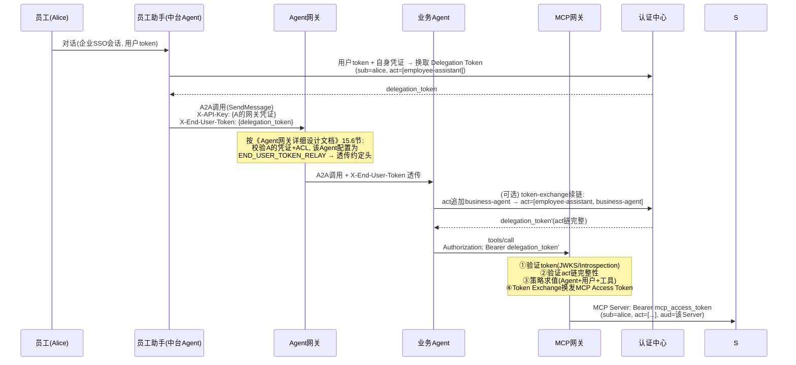
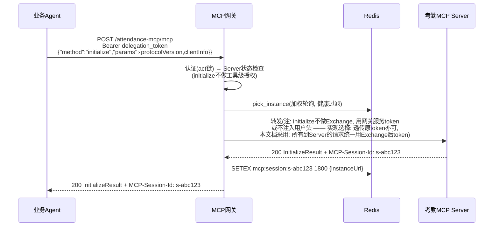
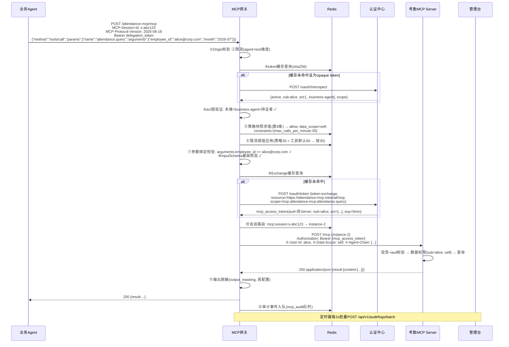
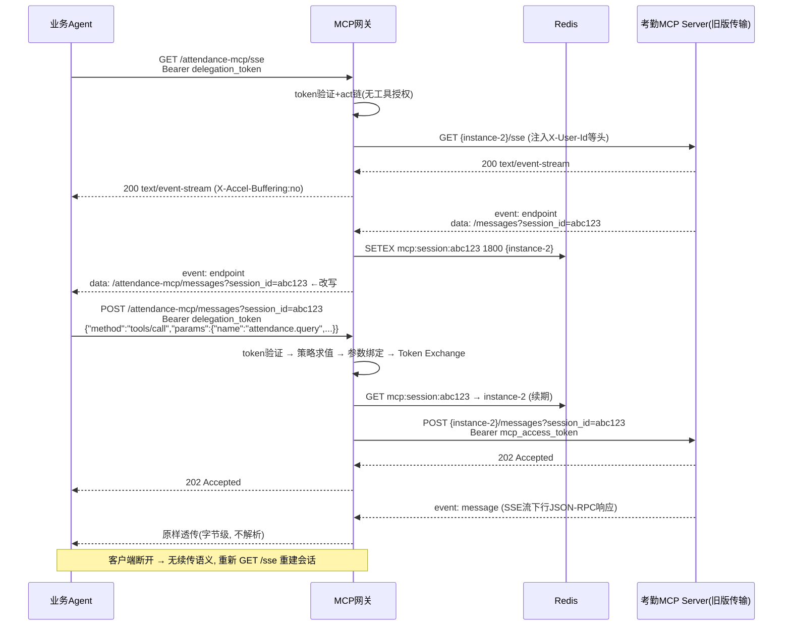

# MCP 网关详细设计文档

> 版本：V2.0（对齐 MCP Specification 2025-11-25）
> 前置文档：《MCP网关设计文档.md》（初步设计）、《Agent网关详细设计文档.md》（姊妹系统）
> 本文档是代码开发前的完整设计基线。附录 16.1 列出了对原初步设计文档的全部修改及原因。

---

## 目录

1. [概述](#1-概述)
2. [MCP 协议要点摘要](#2-mcp-协议要点摘要)
3. [总体架构](#3-总体架构)
4. [身份与授权模型](#4-身份与授权模型)
5. [核心数据模型](#5-核心数据模型)
6. [管理台详细设计](#6-管理台详细设计)
7. [MCP 网关详细设计](#7-mcp-网关详细设计)
8. [策略求值设计](#8-策略求值设计)
9. [核心流程时序](#9-核心流程时序)
10. [错误处理设计](#10-错误处理设计)
11. [安全设计](#11-安全设计)
12. [审计设计](#12-审计设计)
13. [可观测性设计](#13-可观测性设计)
14. [非功能性设计](#14-非功能性设计)
15. [测试策略与开发任务拆解](#15-测试策略与开发任务拆解)
16. [附录](#16-附录)

---

## 1. 概述

### 1.1 业务场景

```
员工(Alice) → 员工助手(中台Agent) → Agent网关(已有) → 业务Agent → MCP网关 → MCP Server → 业务系统
                                                              ↕
                                                          管理台(控制平面)
                                                              ↕
                                                        认证中心(IdP, 企业已有)
```

在多跳 Agent 调用链中，终端用户的身份与委托关系必须安全、可审计地传递到 MCP Server，同时平台提供 MCP 服务的注册、发现、授权、审计能力（MCP 市场）。

### 1.2 设计目标

| 目标 | 说明 |
|---|---|
| 身份传播 | 终端用户身份以 audience 绑定的委托令牌（Delegation Token）传递到 MCP 网关，经 Token Exchange 换发为 MCP Server 专用令牌，**禁止原始 Token 透传**（MCP 授权规范强制要求） |
| 委托验证 | 验证 `act`（actor）委托链完整性，防 Confused Deputy |
| 工具级授权 | Tool 级访问控制（Agent/用户/角色/组四个维度），最小权限 |
| 协议兼容 | 兼容 MCP 2025-11-25 规范，Streamable HTTP 传输，完整支持会话管理与 SSE |
| 审计追踪 | 全链路审计：谁 → 通过哪个 Agent（链）→ 调用了哪个 Server 的什么工具 → 结果如何 |
| 市场能力 | MCP Server/Tool 注册、市场展示、授权管理、审计查询 |

### 1.3 范围

- **包含**：MCP 网关（OpenResty 数据面）、管理台（Spring Boot + React 控制平面）、认证中心对接契约与 Mock、审计链路。
- **不包含**：MCP Server 自身的实现规范（仅定义网关对下游的接入契约）；认证中心内部实现（企业已有）；stdio 传输（仅 HTTP 系传输经过网关）。
- **与 Agent 网关的关系**：两者独立部署、独立演进。Agent 网关代理 A2A 协议（Agent↔Agent），MCP 网关代理 MCP 协议（Agent→工具）。集成契约见 3.5。

### 1.4 术语表

| 术语 | 含义 |
|---|---|
| MCP | Model Context Protocol，本文档特指 2025-11-25 版本规范 |
| MCP Server | 提供工具/资源/提示词的服务端（资源服务器） |
| 业务Agent | MCP 客户端，代表用户调用工具的一方 |
| Delegation Token | 委托令牌：由 IdP 颁发，`sub`=终端用户，`act`=委托链（各跳 Agent） |
| MCP Access Token | 经 Token Exchange 换发的、audience 绑定到特定 MCP Server 的短时令牌 |
| IdP / 认证中心 | 企业身份认证中心（OAuth 2.1 AS），提供 Introspection、Token Exchange、JWKS |
| 委托链 (act chain) | RFC 8693 `act` claim 嵌套结构，记录"谁代表谁"的传递路径 |
| Streamable HTTP | MCP 2025-03-26 起唯一的 HTTP 传输形态（单一端点 POST+GET） |

---

## 2. MCP 协议要点摘要

> 本章摘录网关必须感知的协议内容（2025-11-25 版本），作为后续设计依据。完整规范见 <https://modelcontextprotocol.io/specification/2025-11-25>。

### 2.1 Streamable HTTP 传输（网关必须完整支持）

| 要点 | 规范要求 | 网关行为 |
|---|---|---|
| 单一端点 | Server MUST 提供同时支持 POST 和 GET 的单一 MCP 端点 | 网关为每个 MCP Server 暴露 `/{serverId}/mcp`（POST/GET/DELETE） |
| POST 请求 | 每条 JSON-RPC 消息一个新 POST；客户端 MUST 带 `Accept: application/json, text/event-stream` | 透传 |
| 通知/响应输入 | JSON-RPC notification 或 response → 服务器返回 **202 无 body** | 透传（202 语义不得被破坏） |
| 请求输入 | JSON-RPC request → 服务器返回 `application/json` **或** `text/event-stream` 之一 | 按 Content-Type 分流：JSON 缓冲转发 / SSE 流式透传 |
| GET 请求 | 打开独立 SSE 流（`Accept: text/event-stream`），或不支持时返回 405 | 流式透传 |
| SSE 启动 | 服务器 SHOULD 立即发送"事件 ID + 空 data"的引导事件；可在发送 `retry` 字段后关闭连接而**不终止流**，客户端按 retry 轮询重连 | 流式透传所有 SSE 字段（`id:`/`data:`/`retry:`），不解析不丢弃 |
| 断线续传 | 事件可带 `id` 字段；客户端用 GET + `Last-Event-ID` 恢复（无论流最初由 POST 还是 GET 发起） | 透传 `Last-Event-ID`；**会话路由必须保证重连落到同一后端实例**（见 7.6） |
| 会话管理 | 服务器可在 InitializeResult 响应中返回 `MCP-Session-Id` 头；客户端后续请求 MUST 携带；会话终止后服务端对旧 session 返回 404，客户端应重新 initialize；客户端可 DELETE 终止 | **透传** `MCP-Session-Id`；路由以该头为粘滞键；DELETE 透传 |
| 协议版本头 | 初始化后所有请求 MUST 带 `MCP-Protocol-Version`；缺失时服务端按 2025-03-26 处理；不支持的版本 MUST 返回 400 | 透传；网关记录版本用于审计 |
| Origin 校验 | 服务端 MUST 校验 `Origin` 头防 DNS 重绑定，非法时 MUST 返回 403 | 网关执行（可配置域名白名单，Agent 服务端调用通常无 Origin，放行） |

### 2.2 授权规范（MCP Authorization，基于 OAuth 2.1）

关键强制项（原文引用级别）：

1. **MCP Server 是 OAuth 2.1 Resource Server**，MUST 验证 access token 是**专门颁发给它的**（audience 校验，RFC 8707）。
2. **"MCP servers MUST NOT accept or transit any other tokens"** —— 禁止 Token 透传：MCP Server 不得接受非颁发给自己的 token，也不得把收到的 token 原样转发给下游 API。
3. 401 响应 MUST 携带 `WWW-Authenticate` 头（RFC 9728 Protected Resource Metadata 指引）。
4. 错误语义：401=未认证/token 无效；403=scope 不足/权限不够；400=授权请求畸形。
5. 资源指示器（RFC 8707）：token 请求 MUST 携带 `resource` 参数，取值为 MCP Server 的**规范化 URI**（小写 scheme/host、无 fragment、无尾斜杠）。

**对本设计的约束**：网关在 Token Exchange 时以每个 Server 注册的 `resource_uri`（规范化 URI）为 audience 换发专用 token；MCP Server 接入契约（7.9）要求其必须校验 `aud`。

### 2.3 网关感知的方法清单

网关只做**信封级解析**（`jsonrpc`/`id`/`method`/`params.name`），不深入业务参数语义（除 11.3 的参数绑定校验外）：

| 方法 | 方向 | 网关特殊处理 |
|---|---|---|
| `initialize` | C→S | 审计记录协议版本与 clientInfo；响应中的 `MCP-Session-Id` 建立会话路由映射 |
| `notifications/initialized`、`notifications/cancelled`、其他 notifications | C→S | 202 语义透传 |
| `ping` | 双向 | 透传 |
| `tools/list` | C→S | 透传；响应可选用于管理台元数据核对 |
| `tools/call` | C→S | **核心管控点**：工具路由、策略求值、Token Exchange、参数绑定校验、限流 |
| `resources/list`、`resources/read`、`resources/templates/list` | C→S | 透传（Server 级授权） |
| `prompts/list`、`prompts/get` | C→S | 透传（Server 级授权） |
| `completion/complete`、`logging/setLevel` | C→S | 透传 |
| `roots/list`、`sampling/createMessage`、`elicitation/create` | S→C | 经 SSE 流或 POST 响应透传 |
| `notifications/*`（S→C） | S→C | SSE 流透传 |

### 2.4 旧版 HTTP+SSE 传输（2024-11-05，必须兼容）

2024-11-05 版本定义的 HTTP+SSE 传输已被 Streamable HTTP 取代，但**存量 MCP Server（Spring AI `WebMvcSseServerTransportProvider`、旧版 SDK 等）普遍仍在使用**，本设计将其列为必选兼容项（7.7 节详细设计）。其模型：

1. **双端点**：客户端 `GET {server}/sse` 打开 SSE 长连接；服务端在流上发送的**第一个事件**为 `event: endpoint`，`data` 是客户端后续提交消息的 URI（如 `/messages?session_id=abc`，session_id 由服务端生成）。
2. 客户端所有 JSON-RPC 消息通过 `POST {messages-uri}` 提交，服务端返回 **202 Accepted**（无 body）。
3. 服务端的 JSON-RPC 响应/请求/通知全部经 SSE 流下行。
4. 无 `MCP-Session-Id`/`MCP-Protocol-Version` 头（这些是 2025-03-26 才引入的），无 `Last-Event-ID` 续传语义——断线只能重建连接。

**网关适配的三个技术难点**（详见 7.7）：endpoint 事件的 URI 改写（内网地址→网关地址）、session_id 与后端实例的映射建立、`/messages` 路由。

---

## 3. 总体架构

### 3.1 子系统与职责边界

| 子系统 | 技术栈 | 做什么 | 不做什么 |
|---|---|---|---|
| **MCP 网关** | OpenResty + Lua + 共享 Redis Cluster | 协议接入（Streamable HTTP 全语义）、认证（JWKS/Introspection）、委托链验证、策略求值、Token Exchange、限流、路由与负载均衡、转发、参数绑定校验、输出脱敏、审计上报 | 不持久化业务数据；不做数据级权限判断（资源侧职责）；不管理注册表 |
| **管理台** | Spring Boot 3 + MyBatis-Plus + MySQL + React | MCP Server/Tool 注册与生命周期、授权策略配置与审批、市场展示、审计查询、策略/注册表同步到 Redis、IdP 对接（含 Mock） | 不处理实时请求流；不做 Token 验证（委托 IdP） |
| **认证中心 (IdP)** | 企业已有（开发期 Mock） | 用户/Agent 身份认证、Delegation Token 颁发、Token Exchange (RFC 8693)、Introspection (RFC 7662)、JWKS | 不了解 MCP 协议细节；不管理工具权限 |
| **Agent 网关** | 已有系统（姊妹项目） | A2A 协议代理（员工助手 → 业务Agent 一跳） | 对委托凭证透明（按 3.5 契约透传约定头） |

### 3.2 部署拓扑

```mermaid
flowchart TD
    subgraph 调用链
        BA[业务Agent] -->|HTTPS| LB[负载均衡]
    end
    subgraph MCP网关集群
        LB --> GW1[OpenResty Pod 1]
        LB --> GW2[OpenResty Pod 2]
        GW1 <--> RC[(Redis Cluster<br/>配置/策略/缓存/限流)]
        GW2 <--> RC
    end
    subgraph 管理台
        UI[React 门户] --> ADM[Spring Boot 管理台]
        ADM --> DB[(MySQL 8)]
        ADM -->|直写注册表/策略快照<br/>(单一写入方)| RC
        ADM -.->|失效通知(可选即时)| GW1
    end
    subgraph IdP[认证中心/IdP]
        AS[OAuth2.1 AS<br/>Introspection/Exchange/JWKS]
    end
    subgraph 上游
        S1[考勤MCP Server]
        S2[薪资MCP Server]
    end
    GW1 --> AS
    GW1 --> S1
    GW2 --> S2
    GW1 -->|批量审计上报| ADM
```

### 3.3 与 Agent 网关的 Redis 模型差异说明

Agent 网关采用"每节点本地 Redis + 节点轮询拉取"；MCP 网关采用**集中式 Redis Cluster + 管理台直写**。原因：MCP 网关的运行时数据（限流计数、Token 缓存、会话映射、策略决策缓存）本身需要跨节点共享，集中 Redis 是必要设施，配置同步直接复用它即可，无需额外同步层。管理台是 Redis 配置数据的**唯一写入方**，网关只读配置、读写运行时缓存。

### 3.4 端点规划

| 端点 | 说明 |
|---|---|
| `https://mcp-gw.example.com/{serverId}/mcp` | MCP 协议主端点（POST/GET/DELETE，Streamable HTTP） |
| `https://mcp-gw.example.com/{serverId}/sse` + `/{serverId}/messages` | 旧版 HTTP+SSE 传输兼容端点（**必选，Phase 1 与主端点同期交付**，见 7.7） |
| `https://mcp-gw.example.com/.well-known/oauth-protected-resource` | RFC 9728 资源元数据（Phase 2，对外部 MCP Client 合规） |
| `http://pod:8080/healthz` `/readyz` `/statusz` | 健康/就绪/同步状态（K8s 探针与看板） |
| `http://pod:8080/metrics` | Prometheus 指标（内网） |
| `http://pod:8080/admin/invalidate` | 管理台缓存失效通知（内网 + `X-Internal-Key`） |
| `https://mcp-admin.example.com/api/v1/**` | 管理台 API |

`serverId` 命名约束：`^[a-z0-9][a-z0-9-]{1,62}$`。

### 3.5 与 Agent 网关的集成契约（端到端身份链）

员工助手 →（Agent 网关）→ 业务Agent →（MCP 网关）→ MCP Server 的凭证传递约定：



**契约要点**：
1. Agent 网关对 `X-End-User-Token` 的处理规则以其设计文档 15.6 节为准（仅 `END_USER_TOKEN_RELAY` 类型透传，其余擦除）。
2. 业务Agent 调 MCP 网关时**必须**使用 Delegation Token（`sub`=用户 + `act`=委托链），不允许使用 Agent 自己的服务 token 代表用户（无 `sub` 的 token 只能访问标记为"服务级"的工具）。
3. 委托链每一跳都应在 IdP 续链（token-exchange），使最终 `act` 反映完整路径；MCP 网关校验链的连续性与末端 Actor 是否等于实际调用方。

---

## 4. 身份与授权模型

### 4.1 Token 类型与生命周期

| Token | 颁发方 | 受众 (aud) | 关键 claim | 有效期 | 使用位置 |
|---|---|---|---|---|---|
| 用户 SSO Token | IdP | 员工助手/会话层 | `sub`=用户 | 1h（可刷新） | 人 ↔ Agent 会话层 |
| Delegation Token | IdP (token-exchange) | `mcp-gateway`（网关 audience） | `sub`=用户, `act`=[嵌套委托链], `scope`, `jti` | 1h | 业务Agent → MCP 网关 |
| MCP Access Token | IdP (token-exchange) | 目标 Server 的 `resource_uri` | `sub`=用户, `act`=同上, `aud`=Server, `scope`=工具scope, `jti` | 5min | MCP 网关 → MCP Server |
| Agent 服务 Token | IdP | `mcp-gateway` | `sub`=agent-id, 无用户上下文 | 1h | 服务级工具调用（无用户身份场景） |

**网关自身凭证**：网关作为 OAuth confidential client 在 IdP 注册（`client_id`/`client_secret`，K8s Secret 注入），用于 Introspection 与 Token Exchange 的 actor 凭证。

### 4.2 Delegation Token 验证流程（网关 auth 模块）

```
1. 提取 Authorization: Bearer <token>
2. 判定token形态:
   - JWT形态(两段点号): 快路径 → 本地JWKS验签(lua-resty-jwt) + exp/iss/aud检查
     (aud必须包含 "mcp-gateway")
   - opaque: 慢路径 → POST {idp}/oauth/introspect (带网关client凭证)
     结果按 sha256(token) 缓存30s (mcp:token:verify:{hash})
3. active/exp/aud 校验 → 失败 401 (带WWW-Authenticate, 见10.2)
4. act委托链验证:
   - act结构(RFC 8693嵌套): {"act": {"sub":"employee-assistant","act":{"sub":"business-agent"}}}
     最内层 = 直接调用方
   - 校验: 最内层act.sub 必须等于token呈现的client身份(client_id/azp), 即"持证者确是委托链末端"
   - 链长上限5跳, 防构造攻击
5. jti重放防护(可选, Phase 2): mcp:token:jti:{jti} SET NX EX=token剩余有效期
6. 身份上下文写入 ngx.ctx:
   {user_sub, org_id(从IdP用户信息或token claim), agent_chain[], direct_caller,
    scopes, token_hash}
```

### 4.3 Token Exchange 流程（网关 exchange 模块）

对需要用户身份的 Server（`auth_mode=user-delegation`）：

```
POST {idp}/oauth/token  (网关client凭证Basic认证)
Content-Type: application/x-www-form-urlencoded

grant_type=urn:ietf:params:oauth:grant-type:token-exchange
&subject_token={delegation_token}
&subject_token_type=urn:ietf:params:oauth:token-type:access_token
&actor_token={网关服务token}
&actor_token_type=urn:ietf:params:oauth:token-type:access_token
&resource={server.resource_uri}        # RFC 8707, 规范化URI
&scope={工具对应的scope}
```

- 缓存：key = `mcp:token:exchange:{sha256(subject_token_hash + resource + scope)}`，TTL = `min(token剩余有效期, 240s)`。
- 换得的 MCP Access Token 注入下游 `Authorization` 头；**原始 Delegation Token 绝不转发**（MCP 规范 MUST 级要求）。
- Exchange 失败（IdP 4xx/5xx）→ 502 `-32013`，审计记录。

### 4.4 防 Confused Deputy 设计（分层防线）

| 层 | 机制 |
|---|---|
| 1. 令牌受众 | Delegation Token aud=`mcp-gateway`（不能直接去 MCP Server）；MCP Access Token aud=具体 Server（不能横向复用到其他 Server） |
| 2. 委托链 | act 链验证确保持证者=委托链末端；链完整可追溯 |
| 3. 工具授权 | 策略求值：该 Agent 链 + 该用户 是否被显式授权该工具（第 8 章） |
| 4. 参数绑定 | per-tool 配置：工具参数必须与委托身份绑定（如 `employee_id` 必须等于 `sub` 对应邮箱），网关在调用前强制校验（11.3） |
| 5. 头部 hygiene | 入站剥离全部 `X-User-*`/`X-Org-*`/`X-Data-Scope` 等头，仅由网关注入（11.2） |
| 6. 下游信任 | MCP Server 必须校验 token aud=自己 + 验签（JWKS）；与网关间建议 mTLS 或网络策略隔离 |

---

## 5. 核心数据模型

### 5.1 MySQL 表结构（管理台）

> 对原设计的修正：`mcp_servers` 增加 `resource_uri`/`auth_mode`/`instances`，移除无支撑的 `rating`（评论功能移至 Phase 3）；`mcp_tools` 增加 `subject_bindings`/`output_masking`/`validation_level`；`audit_logs` 主键修正为 `(id, timestamp)` 使年分区合法，并增加 `jsonrpc_method`/`delegation_chain` 字段。字符集统一 utf8mb4。

#### mcp_servers — MCP Server 注册表

```sql
CREATE TABLE `mcp_servers` (
  `id`                 bigint       NOT NULL AUTO_INCREMENT,
  `server_id`          varchar(64)  NOT NULL COMMENT '唯一标识, ^[a-z0-9][a-z0-9-]{1,62}$',
  `name`               varchar(128) NOT NULL,
  `description`        text,
  `category`           varchar(32)  DEFAULT NULL COMMENT 'hr/finance/office/dev/...',
  `base_url`           varchar(512) NOT NULL COMMENT '默认后端地址(无实例列表时使用)',
  `instances`          json         DEFAULT NULL COMMENT '后端实例列表 [{"url":"https://...","weight":1}], 支持负载均衡',
  `protocol_type`      varchar(16)  NOT NULL DEFAULT 'streamable-http' COMMENT 'streamable-http|http-sse(legacy)',
  `resource_uri`       varchar(512) NOT NULL COMMENT 'RFC8707规范化资源URI, Token Exchange的audience',
  `auth_mode`          varchar(24)  NOT NULL DEFAULT 'user-delegation' COMMENT 'user-delegation(需用户委托)|service(服务级)|none',
  `health_endpoint`    varchar(128) NOT NULL DEFAULT '/health',
  `data_classification` varchar(32) DEFAULT 'internal' COMMENT 'public/internal/confidential/restricted',
  `owner_team`         varchar(64)  DEFAULT NULL,
  `owner_email`        varchar(128) DEFAULT NULL,
  `status`             tinyint      NOT NULL DEFAULT 0 COMMENT '0:草稿 1:待审 2:活跃 3:废弃',
  `version`            varchar(32)  DEFAULT NULL,
  `health_status`      varchar(16)  NOT NULL DEFAULT 'unknown',
  `health_checked_at`  datetime     DEFAULT NULL,
  `total_calls`        bigint       NOT NULL DEFAULT 0 COMMENT '由审计统计任务回写',
  `avg_latency_ms`     int          DEFAULT NULL,
  `created_by`         varchar(128) DEFAULT NULL,
  `created_at`         datetime     NOT NULL DEFAULT CURRENT_TIMESTAMP,
  `updated_at`         datetime     NOT NULL DEFAULT CURRENT_TIMESTAMP ON UPDATE CURRENT_TIMESTAMP,
  `deleted`            tinyint      NOT NULL DEFAULT 0,
  PRIMARY KEY (`id`),
  UNIQUE KEY `uk_server_id` (`server_id`)
) ENGINE=InnoDB DEFAULT CHARSET=utf8mb4;
```

#### mcp_tools — 工具元数据

```sql
CREATE TABLE `mcp_tools` (
  `id`                 bigint       NOT NULL AUTO_INCREMENT,
  `server_id`          varchar(64)  NOT NULL,
  `tool_name`          varchar(128) NOT NULL,
  `description`        text,
  `input_schema`       json         DEFAULT NULL COMMENT 'MCP inputSchema(JSON Schema)',
  `output_schema`      json         DEFAULT NULL,
  `annotations`        json         DEFAULT NULL COMMENT 'MCP annotations, 如{"readOnlyHint":true}',
  `required_scope`     varchar(128) DEFAULT NULL COMMENT 'Token Exchange时请求的scope, 默认 mcp:{serverId}:{toolName}',
  `rate_limit_rpm`     int          NOT NULL DEFAULT 60 COMMENT '默认每分钟限流(被策略约束覆盖)',
  `subject_bindings`   json         DEFAULT NULL COMMENT '参数绑定校验 [{"param":"employee_id","claim":"email","required":true}]',
  `validation_level`   varchar(16)  NOT NULL DEFAULT 'basic' COMMENT 'none|basic(类型/必填/枚举)|schema(完整JSON Schema)',
  `output_masking`     json         DEFAULT NULL COMMENT '输出脱敏规则 [{"pattern":"...","replacement":"***"}]',
  `data_classification` varchar(32) DEFAULT NULL,
  `is_active`          tinyint      NOT NULL DEFAULT 1,
  `created_at`         datetime     NOT NULL DEFAULT CURRENT_TIMESTAMP,
  `updated_at`         datetime     NOT NULL DEFAULT CURRENT_TIMESTAMP ON UPDATE CURRENT_TIMESTAMP,
  PRIMARY KEY (`id`),
  UNIQUE KEY `uk_server_tool` (`server_id`, `tool_name`)
) ENGINE=InnoDB DEFAULT CHARSET=utf8mb4;
```

#### auth_policies — 授权策略表

```sql
CREATE TABLE `auth_policies` (
  `id`             bigint       NOT NULL AUTO_INCREMENT,
  `policy_name`    varchar(128) NOT NULL,
  `server_id`      varchar(64)  NOT NULL,
  `tool_name`      varchar(128) NOT NULL DEFAULT '*' COMMENT '工具名, *=全部',
  `grantee_type`   varchar(16)  NOT NULL COMMENT 'AGENT|USER|ROLE|GROUP',
  `grantee_id`     varchar(128) NOT NULL COMMENT '对象ID; AGENT支持委托链末端匹配',
  `grantee_name`   varchar(128) DEFAULT NULL,
  `data_scope`     varchar(16)  NOT NULL DEFAULT 'self' COMMENT 'self|team|department|organization (上下文传递, 资源侧执行)',
  `constraints`    json         DEFAULT NULL COMMENT '{"max_calls_per_minute":60,"time_range":"09:00-18:00"}',
  `effect`         varchar(8)   NOT NULL DEFAULT 'ALLOW' COMMENT 'ALLOW|DENY (DENY优先)',
  `effective_time` datetime     DEFAULT NULL,
  `expiry_time`    datetime     DEFAULT NULL,
  `status`         tinyint      NOT NULL DEFAULT 0 COMMENT '0:待审 1:生效 2:过期 3:撤销',
  `approved_by`    varchar(128) DEFAULT NULL,
  `approved_at`    datetime     DEFAULT NULL,
  `created_by`     varchar(128) DEFAULT NULL,
  `created_at`     datetime     NOT NULL DEFAULT CURRENT_TIMESTAMP,
  `updated_at`     datetime     NOT NULL DEFAULT CURRENT_TIMESTAMP ON UPDATE CURRENT_TIMESTAMP,
  PRIMARY KEY (`id`),
  KEY `idx_server_status` (`server_id`, `status`),
  KEY `idx_grantee` (`grantee_type`, `grantee_id`)
) ENGINE=InnoDB DEFAULT CHARSET=utf8mb4;
```

> 原设计的 `allowed_scopes`/`allowed_tools` 列与 `tool_name` 语义重叠，已移除——一条策略 = (server, tool或*, grantee, effect, data_scope, constraints)。需要多工具授权时批量建策略（管理台 API 支持 batch）。

#### audit_logs — 审计日志表

```sql
CREATE TABLE `audit_logs` (
  `id`               bigint       NOT NULL AUTO_INCREMENT,
  `request_id`       varchar(64)  NOT NULL,
  `trace_id`         varchar(64)  DEFAULT NULL,
  `timestamp`        datetime(3)  NOT NULL COMMENT '毫秒精度',
  `caller_agent_id`  varchar(64)  DEFAULT NULL COMMENT '委托链末端(直接调用方)',
  `delegation_chain` varchar(512) DEFAULT NULL COMMENT '完整委托链JSON ["employee-assistant","business-agent"]',
  `delegator_user_id` varchar(128) DEFAULT NULL COMMENT '终端用户sub(无用户委托时为NULL)',
  `delegator_org_id` varchar(64)  DEFAULT NULL,
  `jsonrpc_method`   varchar(64)  DEFAULT NULL COMMENT 'MCP方法名',
  `tool_name`        varchar(128) DEFAULT NULL,
  `server_id`        varchar(64)  NOT NULL,
  `request_args_hash` varchar(64) DEFAULT NULL COMMENT 'SHA-256(规范化的arguments)',
  `auth_result`      varchar(16)  NOT NULL COMMENT 'success|failed',
  `policy_decision`  varchar(16)  DEFAULT NULL COMMENT 'allow|deny|n/a',
  `deny_reason`      varchar(256) DEFAULT NULL,
  `token_exchanged`  tinyint      NOT NULL DEFAULT 0,
  `latency_ms`       int          DEFAULT NULL,
  `upstream_latency_ms` int       DEFAULT NULL,
  `response_status`  int          DEFAULT NULL,
  `response_size`    int          DEFAULT NULL,
  `client_ip`        varchar(64)  DEFAULT NULL,
  `created_at`       datetime     NOT NULL DEFAULT CURRENT_TIMESTAMP,
  PRIMARY KEY (`id`, `timestamp`),
  KEY `idx_ts_server` (`timestamp`, `server_id`),
  KEY `idx_user_ts` (`delegator_user_id`, `timestamp`),
  KEY `idx_agent_ts` (`caller_agent_id`, `timestamp`),
  KEY `idx_request_id` (`request_id`)
) ENGINE=InnoDB DEFAULT CHARSET=utf8mb4
  PARTITION BY RANGE COLUMNS(`timestamp`) (
    PARTITION p2026 VALUES LESS THAN ('2027-01-01'),
    PARTITION p2027 VALUES LESS THAN ('2028-01-01'),
    PARTITION pmax  VALUES LESS THAN MAXVALUE
  );
```

> MySQL 分区键必须出现在所有唯一键中，故主键改为 `(id, timestamp)`。分区由定时任务预先创建；归档清理时直接 `DROP PARTITION`。

#### 其余表（保持原设计，简化列出）

- `agent_bindings`（P2）：Agent↔Server 绑定关系，字段同原设计。
- `user_bindings`（P2）：用户↔Server 绑定关系，字段同原设计。
- `idp_mock_users`/`idp_mock_agents`（仅 dev）：Mock 认证中心的测试数据。

### 5.2 Redis 数据结构（集中式 Cluster）

**配置数据**（管理台为唯一写入方）：

| Key | 类型 | 内容 |
|---|---|---|
| `mcp:server:cfg:{serverId}` | Hash | 路由配置：`base_url`、`instances`(JSON)、`resource_uri`、`auth_mode`、`health_endpoint`、`status`、`protocol_type` |
| `mcp:server:tools:{serverId}` | Hash | field=toolName, value=工具元数据 JSON（`required_scope`/`rate_limit_rpm`/`subject_bindings`/`validation_level`/`output_masking`/`is_active`） |
| `mcp:policy:snapshot:{serverId}` | String | 该 Server 全部生效策略快照 JSON 数组（第 8 章），带 `version` 字段 |
| `mcp:idp:user:{userId}` | String | 用户上下文缓存（org/dept/roles/groups），TTL 5min（网关写入） |

**运行时数据**（网关写入）：

| Key | 类型 | TTL | 内容 |
|---|---|---|---|
| `mcp:token:verify:{sha256}` | String | 30s | Introspection 结果 JSON |
| `mcp:token:exchange:{sha256}` | String | ≤240s | Exchange 所得 token JSON（含 expires_at） |
| `mcp:token:jti:{jti}` | String | token剩余有效期 | jti 防重放标记（Phase 2） |
| `mcp:session:{sessionId}` | String | 30min（滚动续期） | 会话→后端实例 URL 映射（两种传输共用：Streamable HTTP 取 `MCP-Session-Id`，旧版取 endpoint 事件中的 session_id） |
| `mcp:policy:decision:{sha256}` | String | 30s | 策略决策结果缓存（allow/deny+reason） |
| `mcp:rl:{dim}:{id}` | String（Lua脚本维护） | 120s | 令牌桶状态 `{tokens, last_ts}`，dim=agent/user/tool |
| `mcp:server:health:{serverId}` | Hash | 无（探测任务维护） | field=实例URL, value=`{"healthy":true,"fail_count":0,"checked_at":...}` |

### 5.3 shared_dict（网关节点内）

| Zone | 大小 | 用途 | TTL |
|---|---|---|---|
| `mcp_cache` | 20m | 路由配置/策略快照/工具元数据/决策缓存/JWKS | 60s（配置类） |
| `mcp_locks` | 2m | resty.lock（JWKS 刷新、exchange 单飞） | - |
| `mcp_audit` | 10m | 审计队列（批量 flush） | - |

---

## 6. 管理台详细设计

### 6.1 技术栈与工程结构

Spring Boot 3.2 + MyBatis-Plus + MySQL 8（测试 H2 MySQL 模式）+ Spring Security + springdoc-openapi。包结构：

```
com.corp.mcp.admin
├── McpAdminApplication.java
├── common/ (Result, BizException, GlobalExceptionHandler)
├── config/ (SecurityConfig, RedisConfig, IdPClientConfig, WebMvcConfig)
├── controller/
│   ├── MarketController        /api/v1/market/**
│   ├── RegistryController      /api/v1/registry/**
│   ├── AuthPolicyController    /api/v1/auth/**
│   ├── AuditController         /api/v1/audit/**
│   ├── SyncController          /api/v1/sync/**      (同步状态)
│   └── HealthController        /actuator
├── service/
│   ├── MarketService / RegistryService(含discover远程tools/list)
│   ├── AuthPolicyService(含审批流、过期任务)
│   ├── AuditService(批量接收/查询/统计)
│   ├── RedisSyncService(注册表+策略快照直写Redis, 唯一写入方)
│   └── IdPClientService(Introspection/Exchange/用户/Agent查询, dev=Mock)
├── domain/ (entity/dto/vo/enums)
├── mapper/
└── security/ (OIDC登录, 角色: SUPER_ADMIN/PUBLISHER/AUDITOR/VIEWER)
```

### 6.2 管理台自身认证

- 管理员通过企业 SSO（OIDC 授权码流程）登录；Spring Security 完成会话。
- 角色：`SUPER_ADMIN`（全部）、`PUBLISHER`（注册/编辑自己团队的 MCP）、`AUDITOR`（审计查询）、`VIEWER`（市场浏览）。一期角色映射配置化，三期接企业角色体系。
- 内部接口（审计上报、健康回写）使用 `X-Internal-Key` + 内网 ACL。

### 6.3 API 清单（保持原设计并补全）

| 域 | 方法与路径 | 说明 |
|---|---|---|
| 市场 | `GET /api/v1/market/servers?category=&keyword=&page=` | 列表 |
| 市场 | `GET /api/v1/market/servers/{serverId}` | 详情（含 tools/health/统计） |
| 注册 | `POST/PUT/DELETE /api/v1/registry/servers[/{id}]` | CRUD（软删除）；`resource_uri` 唯一性校验 |
| 注册 | `POST /api/v1/registry/servers/{id}/publish` `/deprecate` | 状态流转（草稿→待审→活跃→废弃），发布时写 Redis |
| 注册 | `POST/PUT/DELETE /api/v1/registry/servers/{id}/tools[/{toolName}]` | 工具 CRUD，变更写 Redis |
| 注册 | `POST /api/v1/registry/servers/{id}/discover` | 调远端 `tools/list` 自动导入（管理台以 `service` 身份直连 Server，不经网关） |
| 授权 | `GET/POST/PUT/DELETE /api/v1/auth/policies[...]` | 策略 CRUD + `/approve` 审批 + `/batch` 批量；每次变更**重建该 Server 策略快照写 Redis** |
| 授权 | `POST /api/v1/auth/check` | `{agentChain[], userId, serverId, toolName}` → `{allowed, reason, dataScope, constraints}`（网关兜底 + 前端预检复用同一求值逻辑，见第 8 章） |
| 审计 | `POST /api/v1/audit/logs/batch` | 网关批量上报（内部） |
| 审计 | `GET /api/v1/audit/logs?...` `/statistics?period=` | 查询/统计 |
| 同步 | `GET /api/v1/sync/status` | 各 Server 快照版本、最近写入时间、Redis 连通性 |
| 系统 | `GET/PUT /api/v1/settings/gateway` | 全局限流默认值、缓存 TTL、脱敏开关 |

### 6.4 策略快照发布（RedisSyncService）

策略或注册表每次变更（同事务提交后）：

```java
public void publishServerSnapshot(String serverId) {
    McpServer srv = serverMapper.selectByServerId(serverId);
    List<McpTool> tools = toolMapper.selectActiveByServerId(serverId);
    List<AuthPolicy> policies = policyMapper.selectEffective(serverId, now()); // status=生效 且在有效期内

    // 1. Server 配置
    redis.hset("mcp:server:cfg:" + serverId, Map.of(
        "base_url", srv.getBaseUrl(), "instances", toJson(srv.getInstances()),
        "resource_uri", srv.getResourceUri(), "auth_mode", srv.getAuthMode(),
        "health_endpoint", srv.getHealthEndpoint(), "status", srv.getStatus(),
        "protocol_type", srv.getProtocolType()));

    // 2. 工具元数据
    redis.del("mcp:server:tools:" + serverId);
    tools.forEach(t -> redis.hset("mcp:server:tools:" + serverId, t.getToolName(), toJson(t)));

    // 3. 策略快照(版本自增, 便于网关侧判断更新)
    long ver = redis.incr("mcp:policy:ver:" + serverId);
    redis.set("mcp:policy:snapshot:" + serverId, toJson(new Snapshot(ver, policies)));

    // 4. (可选即时) 通知各网关Pod失效shared_dict: POST /admin/invalidate {serverId}
}
```

快照内策略仅含求值必需字段：`{policyId, toolName, granteeType, granteeId, effect, dataScope, constraints, effectiveTime, expiryTime}`。

### 6.5 IdP 对接契约与 Mock

**IdP 必须提供的端点**（对接契约，生产联调依据）：

| 端点 | 规范 | 说明 |
|---|---|---|
| `POST /oauth/introspect` | RFC 7662 | 入参 `token`；返回 `active/sub/aud/scope/exp/jti/act/client_id` |
| `POST /oauth/token`（token-exchange） | RFC 8693 | 支持 `grant_type=token-exchange`，`subject_token`/`actor_token`/`resource`/`scope`；返回 audience 绑定的短时令牌，`act` 链续接 |
| `GET /.well-known/jwks.json` | RFC 7517 | JWT 验签公钥集 |
| `GET /api/users/{userId}` | 内部 | 返回 `{user_id, email, org_id, dept_id, roles[], groups[]}` |
| `GET /api/agents/{agentId}` | 内部 | 返回 `{agent_id, name, type, owner, scopes[], status}` |

**Mock 实现（dev profile）**：Spring Boot 内嵌 `IdpMockController`，用 RSA 密钥对签发 JWT（Delegation Token 支持按请求构造任意 `act` 链），`mock-data.json` 预置测试用户/Agent；`docker-compose` 中作为独立服务或管理台子模块运行。Mock 与真实 IdP 的切换仅改 `idp.base-url` 配置。

### 6.6 前端页面（保持原设计，调整两处）

页面：登录、MCP 市场首页（卡片/搜索/分类）、MCP 详情（概览/工具/文档/**授权** Tab；评论 Tab 移至 Phase 3）、MCP 发布（基本信息 + 接入信息【含 `resourceUri`、`authMode`、实例列表编辑】+ 工具定义【手动/JSON 导入/自动发现】）、授权管理（策略表格 + 新建弹窗 + 审批）、审计日志（筛选 + 统计面板 + 导出）、系统设置（限流默认值/同步状态/网关节点水位）。

---

## 7. MCP 网关详细设计

### 7.1 nginx.conf 结构

```nginx
worker_processes auto;
events { worker_connections 10240; use epoll; }

http {
    lua_package_path "/etc/nginx/lualib/?.lua;;";
    lua_shared_dict mcp_cache 20m;
    lua_shared_dict mcp_locks 2m;
    lua_shared_dict mcp_audit 10m;

    init_by_lua_file       /etc/nginx/lua/init.lua;         # 配置加载/JWKS预热
    init_worker_by_lua_file /etc/nginx/lua/init_worker.lua; # 定时器: 健康检查/JWKS刷新/审计flush

    log_format mcp_json escape=json
        '{"ts":"$time_iso8601","request_id":"$request_id","server":"$mcp_server_id",'
        '"tool":"$mcp_tool_name","rpc":"$mcp_rpc_method","caller":"$mcp_caller",'
        '"user":"$mcp_user","status":$status,"rt":$request_time,'
        '"upstream_rt":"$mcp_upstream_rt","decision":"$mcp_decision","err":"$mcp_error"}';

    server {
        listen 443 ssl;
        server_name mcp-gw.example.com;
        access_log /var/log/nginx/mcp_access.log mcp_json;
        client_max_body_size 2m;

        # 内部端点
        location ~ ^/(healthz|readyz|statusz|metrics)$ { allow 10.0.0.0/8; deny all; ... }
        location = /admin/invalidate { allow 10.0.0.0/8; deny all;
            content_by_lua_file /etc/nginx/lua/invalidate.lua; }

        # MCP 主端点 (Streamable HTTP)
        location ~ ^/(?<sid>[a-z0-9][a-z0-9-]{1,62})/mcp/?$ {
            set $mcp_server_id $sid;
            access_by_lua_file /etc/nginx/lua/access.lua;    # Origin校验+限流+认证+授权
            content_by_lua_file /etc/nginx/lua/proxy.lua;    # 路由+Exchange+转发+SSE+脱敏
            log_by_lua_file /etc/nginx/lua/audit.lua;        # 审计入队
        }

        # 旧版 HTTP+SSE 传输 (2024-11-05, 必选, 见7.7)
        location ~ ^/(?<sid>[a-z0-9][a-z0-9-]{1,62})/sse/?$ {
            set $mcp_server_id $sid;
            access_by_lua_file /etc/nginx/lua/access.lua;       # 认证(token)即可, 无工具授权
            content_by_lua_file /etc/nginx/lua/proxy_sse.lua;   # SSE流 + endpoint事件改写
            log_by_lua_file /etc/nginx/lua/audit.lua;
        }
        location ~ ^/(?<sid>[a-z0-9][a-z0-9-]{1,62})/messages/?$ {
            set $mcp_server_id $sid;
            access_by_lua_file /etc/nginx/lua/access.lua;       # 认证+tools/call策略求值(同主端点)
            content_by_lua_file /etc/nginx/lua/proxy_messages.lua; # session路由 + 202透传
            log_by_lua_file /etc/nginx/lua/audit.lua;
        }
    }
}
```

> **修正原设计的双代理模型冲突**：删除 `balancer_by_lua` + `proxy_pass` 方案，统一为 `content_by_lua` + `lua-resty-http`（与 Agent 网关一致的技术模型），负载均衡在 proxy 模块内实现。

### 7.2 Lua 模块总览

| 模块 | 文件 | 职责 |
|---|---|---|
| `mcp.util` | util.lua | JSON-RPC 信封解析/错误构造、日志变量、sha256、规范头常量 |
| `mcp.redis` | redis.lua | Redis 连接池、配置读取（shared_dict 旁路缓存） |
| `mcp.access` | access.lua | Origin 校验 → 限流 → Token 验证(JWKS/Introspection) → act 链 → 策略求值 |
| `mcp.idp` | idp.lua | Introspection/Exchange/用户信息查询（含缓存与单飞） |
| `mcp.policy` | policy.lua | 策略快照加载与求值（第 8 章） |
| `mcp.router` | router.lua | Server 配置解析、实例选择、会话粘滞、健康过滤 |
| `mcp.proxy` | proxy.lua | Token Exchange、请求重建（头部注入/剥离）、转发、SSE 透传、参数绑定校验、输出脱敏 |
| `mcp.proxy_sse` | proxy_sse.lua | 旧版传输：GET /sse 流式代理 + endpoint 事件改写 + 会话映射建立（7.7） |
| `mcp.proxy_messages` | proxy_messages.lua | 旧版传输：POST /messages 的 session 路由与 202 透传（7.7） |
| `mcp.audit` | audit.lua | 审计事件入队（shared_dict 队列） |
| `mcp.audit_flush` | audit_flush.lua | init_worker 定时器：批量上报管理台，本地文件兜底 |
| `mcp.health` | health.lua | init_worker 定时器：主动健康探测 + 熔断 |
| `mcp.jwks` | jwks.lua | JWKS 拉取/缓存/刷新（resty.lock 单飞） |
| `mcp.invalidate` | invalidate.lua | 管理台失效通知处理 |
| `mcp.metrics` | metrics.lua | Prometheus 指标（Phase 2） |

### 7.3 access.lua — 认证与授权（请求入口）

```lua
local _M = {}
function _M.run(server_id)
    -- 0. Origin 校验(规范MUST): 白名单域名, 无Origin头(服务端Agent调用)放行
    util.check_origin()

    -- 1. 读取请求体(信封解析, 全链路共用)
    ngx.req.read_body()
    local body = ngx.req.get_body_data()
    local env = util.parse_envelope(body)          -- {id, method, params, is_notification}
    ngx.ctx.envelope = env
    ngx.var.mcp_rpc_method = env.method or ""

    -- 2. 限流(仅对 tools/call 计数; 其他方法走全局宽松阈值)
    rate_limit.check(server_id, env)

    -- 3. Token 验证 (4.2流程)
    local idctx, err = idp.verify_token()          -- {user_sub, org_id, agent_chain, direct_caller, scopes, token_hash}
    if not idctx then return util.abort_auth(err) end
    ngx.ctx.idctx = idctx
    ngx.var.mcp_caller = idctx.direct_caller
    ngx.var.mcp_user = idctx.user_sub or ""

    -- 4. Server 存在性与状态 (透传前最后一道)
    local cfg = redis.get_server_cfg(server_id)    -- shared_dict → Redis
    if not cfg or cfg.status ~= "2" then
        return util.abort(404, -32012, "MCP server not found", env.id)
    end
    ngx.ctx.server_cfg = cfg

    -- 5. 授权: 仅 tools/call 做工具级策略求值; 其他方法要求已认证即可
    if env.method == "tools/call" then
        local tool = env.params and env.params.name
        local tool_meta = redis.get_tool_meta(server_id, tool)
        if not tool_meta or not tool_meta.is_active then
            return util.abort(404, -32602, "Unknown tool: " .. tostring(tool), env.id)
        end
        local decision = policy.evaluate(server_id, tool, idctx)
        ngx.var.mcp_decision = decision.allowed and "allow" or "deny"
        if not decision.allowed then
            return util.abort(403, -32011, "Forbidden: " .. decision.reason, env.id)
        end
        ngx.ctx.tool_meta = tool_meta
        ngx.ctx.policy = decision
    end
end
return _M
```

### 7.4 router.lua — 路由与负载均衡

```lua
local _M = {}
-- 选择后端实例: 会话粘滞 > 健康过滤 > 加权轮询
function _M.pick_instance(cfg)
    local instances = util.parse_instances(cfg)     -- instances JSON 或 base_url 单实例
    local healthy = health.filter(cfg.server_id, instances)

    local session_id = ngx.req.get_headers()["MCP-Session-Id"]
    if session_id then
        -- 会话映射(跨网关Pod共享): 初始化时由proxy写入
        local url = redis.get("mcp:session:" .. session_id)
        if url and table.contains(healthy, url) then return url end
        -- 映射失效(实例下线): 重新选择并重建映射, 上游按规范会对旧session 404,
        -- 客户端自动重新initialize → 新映射建立
    end
    local url = health.weighted_pick(healthy)       -- 加权轮询(无状态方法)
    if session_id then redis.setex("mcp:session:" .. session_id, 1800, url) end
    return url
end
return _M
```

### 7.5 proxy.lua — Exchange、转发与 SSE

```lua
local _M = {}
function _M.run(server_id)
    local ctx = ngx.ctx
    local cfg, env = ctx.server_cfg, ctx.envelope
    local upstream = router.pick_instance(cfg)

    -- 1. Token Exchange (仅 user-delegation 模式且有用户上下文)
    local downstream_token
    if cfg.auth_mode == "user-delegation" and ctx.idctx.user_sub then
        local scope = (ctx.tool_meta and ctx.tool_meta.required_scope)
                      or ("mcp:" .. server_id .. ":" .. (env.params and env.params.name or "*"))
        downstream_token = idp.exchange(ctx.idctx.token_hash, cfg.resource_uri, scope)
        if not downstream_token then
            return util.abort(502, -32013, "Token exchange failed", env.id)
        end
        ctx.token_exchanged = 1
    elseif cfg.auth_mode == "service" then
        downstream_token = idp.gateway_service_token(cfg.resource_uri)  -- 网关服务token
    end
    -- auth_mode == none: 不注入Authorization

    -- 2. 参数绑定校验 (11.3)
    if env.method == "tools/call" and ctx.tool_meta.subject_bindings then
        local ok, perr = util.check_subject_bindings(ctx.tool_meta.subject_bindings,
                                                     env.params.arguments, ctx.idctx)
        if not ok then return util.abort(403, -32016, perr, env.id) end
    end

    -- 3. (可选) 输入Schema校验 (11.3, validation_level)
    if env.method == "tools/call" then
        local ok, verr = util.validate_arguments(ctx.tool_meta, env.params.arguments)
        if not ok then return util.abort(400, -32602, verr, env.id) end
    end

    -- 4. 重建请求头: 剥离→注入 (11.2 清单)
    local headers = util.build_upstream_headers(ctx, downstream_token)

    -- 5. 发起上游请求 (lua-resty-http, 流式API)
    local httpc = http.new()
    local is_sse_possible = true   -- 所有MCP请求都可能返回SSE, 读超时取长值
    httpc:set_timeouts(5000, 10000, 600000)
    local res, rerr = httpc:request({
        scheme = upstream.scheme, host = upstream.host, port = upstream.port,
        path = upstream.path,  method = ngx.req.get_method(),   -- POST/GET/DELETE透传
        body = ngx.req.get_body_data(), headers = headers, ssl_verify = true,
        query = ngx.req.get_uri_args(),
    })
    if not res then return util.abort(502, -32013, "Upstream unavailable", env.id) end
    ctx.upstream_status = res.status

    -- 6. 响应分流
    local ct = res.headers["Content-Type"] or ""
    if ct:find("text/event-stream", 1, true) then
        return _M.stream_sse(res, ctx)              -- SSE: body_reader逐块+flush
    else
        return _M.relay(res, ctx)                    -- JSON/202: 有界缓冲转发
    end
end
return _M
```

SSE 透传与缓冲响应的实现要点与《Agent 网关详细设计文档》6.8 完全相同（`request()` + `res.body_reader`、`ngx.flush(true)`、`X-Accel-Buffering: no`、客户端断开检测），不再重复。**输出脱敏**仅对配置了 `output_masking` 的工具启用：JSON 响应缓冲后正则替换；SSE 按事件行（`data:` 行粒度）流式替换，不缓存整流。

**会话映射建立**：`relay`/`stream_sse` 完成后，若响应头含 `MCP-Session-Id`（initialize 响应），写 `mcp:session:{sessionId} → 实例URL`（TTL 30min，后续请求命中即续期）。

### 7.6 会话与续传支持（规范符合性清单）

| 规范点 | 实现 |
|---|---|
| `MCP-Session-Id` 透传 | 入站→上游、上游→出站，双向透传 |
| 会话粘滞 | `mcp:session:{id}` Redis 映射（跨网关 Pod 共享），见 7.4 |
| `Last-Event-ID` 透传 | 入站透传；路由仍按 `MCP-Session-Id` 粘滞到原实例，续传才能命中上游事件缓存 |
| 通知/响应 202 | 转发后原样返回 202（relay 分支状态码透传） |
| DELETE 会话 | 方法透传；上游 200/405 原样返回；成功后删除 `mcp:session:{id}` |
| 404 会话过期语义 | 上游 404 原样透传，客户端按规范重新 initialize |
| `retry:` 字段 | SSE 字节级透传，不干预 |

### 7.7 旧版 HTTP+SSE 传输兼容设计（必选）

为兼容 2024-11-05 规范的存量 MCP Server（Spring AI 等），网关按 2.4 节模型提供 `/{serverId}/sse` 与 `/{serverId}/messages` 双端点。**与主端点的区别仅在传输适配层**：认证、策略求值、Token Exchange、参数绑定、审计全部复用 access/proxy 既有逻辑。

#### 7.7.1 proxy_sse.lua — GET /sse（流式代理 + endpoint 改写）

```lua
local _M = {}
function _M.run(server_id)
    local cfg = ngx.ctx.server_cfg          -- access.lua 已完成token验证与Server状态检查
    local upstream = router.pick_instance(cfg)

    -- 1. 打开上游SSE流 (GET {instance}/sse)
    local httpc = http.new()
    httpc:set_timeouts(5000, 10000, 600000)
    local res = httpc:request({
        scheme = upstream.scheme, host = upstream.host, port = upstream.port,
        path = upstream.sse_path, method = "GET",
        headers = util.build_upstream_headers(ngx.ctx, nil),  -- 不注入Authorization(连接级);
              -- 用户上下文经 X-User-Id 等头注入; token按message级Exchange, 见7.7.2
        ssl_verify = true,
    })
    if not res then return util.abort(502, -32013, "Upstream unavailable") end

    -- 2. 响应头: SSE + 关闭缓冲
    ngx.status = 200
    ngx.header["Content-Type"] = "text/event-stream"
    ngx.header["Cache-Control"] = "no-cache"
    ngx.header["X-Accel-Buffering"] = "no"
    ngx.flush(true)

    -- 3. 行级状态机: 仅改写 endpoint 事件的 data 行, 其余字节原样透传
    local reader = res.body_reader
    local pending = ""            -- 跨chunk的不完整行缓冲
    local last_event = nil        -- 最近一个 event: 行的值
    while true do
        local chunk = reader(65536)
        if not chunk then break end
        pending = pending .. chunk
        -- 按行切割; 最后一段可能不完整, 留到下一轮
        local pos = 1
        while true do
            local nl = pending:find("\n", pos, true)
            if not nl then break end
            local line = pending:sub(pos, nl - 1)
            pos = nl + 1
            local ev = line:match("^event:%s*(.+)%s*$")
            if ev then last_event = ev end
            if last_event == "endpoint" and line:find("^data:") then
                -- 上游data形如: /messages?session_id=abc (相对) 或 http://internal/... (绝对)
                local session_id = line:match("session_id=([%w%-]+)")
                if session_id then
                    -- 改写为网关地址并建立会话映射
                    line = "data: /" .. server_id .. "/messages?session_id=" .. session_id
                    redis.setex("mcp:session:" .. session_id, 1800, upstream.base)
                    ngx.ctx.legacy_session_id = session_id
                end
                last_event = nil    -- endpoint事件只处理一次data行
            end
            ngx.print(line .. "\n")
            ngx.flush(true)
        end
        pending = pending:sub(pos)
    end
end
return _M
```

**endpoint 改写要点**：
- 上游返回的 `data` 是**内网地址**（相对路径或绝对 URL），不改写则客户端会把消息 POST 到内网——这是旧版传输过网关的**必须处理项**。
- 只处理 `event: endpoint` 后的第一行 `data:`；其余 SSE 事件（`message` 事件承载 JSON-RPC 响应等）**字节级透传**，不解析。
- 行缓冲仅针对跨 chunk 边界的半行，正常 SSE 事件延迟不增加可感知开销。
- 改写的同时**建立会话映射** `mcp:session:{session_id} → 实例URL`（供 7.7.2 路由；旧版 session_id 由上游生成，格式各异，按 `[\w-]+` 宽松提取，提取失败则原样透传并记录告警日志）。

#### 7.7.2 proxy_messages.lua — POST /messages（session 路由 + 202 透传）

```lua
local _M = {}
function _M.run(server_id)
    -- access.lua 已完成: token验证 + 信封解析 + tools/call策略求值(与主端点同一逻辑)
    local session_id = ngx.var.arg_session_id
    if not session_id then return util.abort(400, -32600, "missing session_id", ngx.ctx.envelope.id) end

    -- 1. 会话路由: 必须回到打开SSE流的同一实例(上游会话状态在实例内存中)
    local base = redis.get("mcp:session:" .. session_id)
    if not base then
        -- 映射缺失(过期/实例重启): 404, 客户端按旧版惯例重新 GET /sse 重建会话
        return util.abort(404, -32013, "session expired, re-establish SSE connection", ngx.ctx.envelope.id)
    end
    redis.expire("mcp:session:" .. session_id, 1800)   -- 滚动续期

    -- 2. Token Exchange + 参数绑定(复用proxy.lua逻辑, tools/call时)
    local downstream_token = exchange_if_needed(ngx.ctx)     -- 与7.5第1/2步相同
    local headers = util.build_upstream_headers(ngx.ctx, downstream_token)

    -- 3. 转发到同实例的 /messages, 状态码(202)与body原样透传
    local res = http_post(base .. "/messages?session_id=" .. ngx.escape_uri(session_id),
                          ngx.req.get_body_data(), headers)
    ngx.status = res.status
    if res.body then ngx.print(res.body) end
end
return _M
```

#### 7.7.3 旧版传输的管控等价性

| 管控点 | Streamable HTTP（/mcp） | 旧版（/sse + /messages） |
|---|---|---|
| Token 验证 + act 链 | 每请求 | 每请求（GET /sse 与每个 POST /messages） |
| 工具级策略求值 | tools/call | 同（POST /messages 中解析 tools/call） |
| Token Exchange | tools/call 时 | 同（按 message 级执行） |
| 参数绑定/输入校验 | 同左 | 同左 |
| 限流 | 同左 | 同左 |
| 审计 | 同左 | 同左（`jsonrpc_method` 从 /messages 信封解析） |
| 协议差异 | 有 `MCP-Session-Id`/版本头/续传 | 无协议头；断线重建；会话 id 在 query 参数 |

**已知限制**（旧版协议本身缺陷，非网关限制）：无断线续传（客户端需重建 SSE）；会话凭证暴露在 URL query（仅内网接受，日志中对 `arg_session_id` 脱敏）。

### 7.8 audit.lua + audit_flush.lua — 异步批量审计

```lua
-- audit.lua (log phase): 仅入队, O(1)
function _M.enqueue()
    local q = ngx.shared.mcp_audit
    local event = util.build_audit_event(ngx.ctx)   -- 字段对齐 audit_logs 表
    q:lpush("queue", cjson.encode(event))           -- 队列满则丢弃并计数 metrics
end

-- audit_flush.lua (init_worker timer, 每2s或满100条): 批量上报
function _M.flush()
    local batch = q:lrpop("queue", 100)
    if #batch == 0 then return end
    local res = http_post(ADMIN_URL .. "/api/v1/audit/logs/batch",
                          cjson.encode({logs = batch}),
                          {["X-Internal-Key"] = INTERNAL_KEY}, 3000)
    if not ok(res) then util.write_local_fallback(batch) end  -- /var/log/mcp-gateway/audit-fallback.log
end
```

> 修正原设计"每请求一个 `ngx.timer.at`"的方案（高并发下 timer 耗尽风险），改为队列 + 定时批量。

### 7.9 health.lua — 主动健康检查与熔断

```
init_worker 定时器(每10s, resty.lock保证单worker执行):
  遍历 Redis 中所有活跃 Server 的实例列表:
    GET {instance}{health_endpoint} (超时2s)
    成功 → mcp:server:health:{serverId} HSET {instance} healthy=1, fail_count=0
    失败 → fail_count+1; 连续3次 → healthy=0 (熔断)
    恢复: 探测成功即恢复 healthy=1 (无半开状态的简单模型)
router.pick_instance 只从 healthy=1 的实例中选择;
全部熔断 → 返回 503 -32013 (fail-fast, 不再转发)
```

健康状态同时回写管理台（批量，60s 一次）用于市场页展示 `health_status`。

### 7.10 MCP Server 接入契约（网关对下游的承诺与要求）

**网关注入的请求头**（MCP Server 可依赖）：

| 头 | 说明 |
|---|---|
| `Authorization: Bearer {mcp_access_token}` | aud=该 Server 的 `resource_uri`，`sub`=终端用户，`act`=委托链，`scope`=工具 scope |
| `X-User-Id` / `X-User-Email` | 终端用户标识（`user-delegation` 模式；service 模式无） |
| `X-Org-Id` / `X-Dept-Id` | 用户组织上下文 |
| `X-Data-Scope` | 策略数据范围声明（`self/team/department/organization`），**资源侧据此执行数据权限** |
| `X-Agent-Chain` | 委托链 JSON（审计用） |
| `X-Request-Id` / `X-Trace-Id` | 追踪 ID |
| `MCP-Session-Id` / `MCP-Protocol-Version` / `Last-Event-ID` | 协议头原样透传 |

**MCP Server 必须遵守**：
1. 校验 token 签名（IdP JWKS）与 `aud` == 自身 `resource_uri`（MUST，防横向复用）；
2. 数据级权限基于 `sub`/`X-Data-Scope` 在自身侧执行；
3. 健康检查端点 `GET {health_endpoint}` 返回 200；
4. 遵循 MCP 2025-11-25 Streamable HTTP 语义（会话/SSE/202）。

---

## 8. 策略求值设计

### 8.1 求值模型

原设计的 `mcp:policy:{org}:{agent}:{tool}` 单 key 方案无法支持 USER/ROLE/GROUP 与 `*` 通配。改为**快照 + 本地求值**：

```
输入: server_id, tool, idctx{user_sub, roles[], groups[], agent_chain[], direct_caller}
快照: mcp:policy:snapshot:{server_id} → JSON数组(仅生效策略), shared_dict缓存60s

求值顺序:
 1. 候选集过滤: toolName == tool 或 '*'
 2. 授权对象匹配 (任一命中即纳入):
    AGENT: grantee_id ∈ agent_chain (链上任一Agent被授权均可; direct_caller优先匹配)
    USER:  grantee_id == user_sub
    ROLE:  grantee_id ∈ user.roles
    GROUP: grantee_id ∈ user.groups
 3. 有效期过滤: effective_time ≤ now ≤ expiry_time
 4. 裁决: 存在 DENY → deny(显式拒绝优先); 否则存在 ALLOW → allow; 否则 → deny(默认拒绝)
 5. 约束提取: 命中ALLOW策略的constraints合并(取最严格: min(max_calls_per_minute), time_range交集)
    time_range 不在窗口 → deny("outside allowed time range")
 6. data_scope 取命中ALLOW策略中的最大值(self<team<department<organization), 注入 X-Data-Scope
 7. 结果缓存: mcp:policy:decision:{sha256(server+tool+user+caller+snapshotVersion)} TTL 30s
```

用户 `roles/groups` 来源：`GET {idp}/api/users/{userId}`，缓存 `mcp:idp:user:{userId}` TTL 5min。

### 8.2 决策语义

| 场景 | 结果 |
|---|---|
| 无用户上下文（service 模式 token）+ 存在 AGENT 型 ALLOW | allow，`X-Data-Scope` 不注入 |
| 无用户上下文 + 仅 USER/ROLE/GROUP 型策略 | deny（服务 token 不能冒用用户级授权） |
| 用户与 Agent 分别有不同策略 | 任一 ALLOW 即 allow（并集语义）；任一 DENY 即 deny |
| 策略快照缺失（Redis 无 key） | **fail-closed**：deny("policy snapshot unavailable")，并触发告警 |

---

## 9. 核心流程时序

### 9.1 initialize（会话建立）



> 说明：为简化授权模型，**所有**发往 Server 的请求（含 initialize）都使用 Exchange 后的 MCP Access Token（user-delegation 模式）。这使 Server 侧从第一个请求起就有完整用户上下文。

### 9.2 tools/call 全链路（含 Exchange 与审计）



### 9.3 SSE 流式响应（tools/call 触发流）

时序与 9.2 相同，差异在响应段：上游返回 `text/event-stream` → 网关 `body_reader` 逐块转发 + `ngx.flush(true)` + `X-Accel-Buffering: no`；含 `id:`/`retry:` 字段的 SSE 事件原样透传；客户端断开后以 `GET + MCP-Session-Id + Last-Event-ID` 重连，网关按会话映射路由至**同一实例**完成续传。

### 9.4 旧版 HTTP+SSE 传输时序



### 9.5 拒绝场景

| 场景 | 响应 |
|---|---|
| 无/无效 token | 401 + `WWW-Authenticate` + `{-32010}` |
| act 链断裂（持证者≠链末端） | 401 `{-32010, "invalid delegation chain"}` |
| 策略 deny / 默认拒绝 | 403 `{-32011, "Forbidden: no matching policy"}` |
| 参数绑定违例 | 403 `{-32016, "argument employee_id must match caller identity"}` |
| 限流 | 429 `{-32014}` + `X-RateLimit-*` 头 |
| Server 不存在/非活跃 | 404 `{-32012}` |
| 上游全熔断/超时 | 503 `{-32013}` |
| 非授权域 Origin | 403（无 JSON-RPC body，规范允许） |

---

## 10. 错误处理设计

### 10.1 错误响应结构

JSON-RPC 2.0 错误对象（`id` 能解析则回填，否则 `null`）：

```json
{ "jsonrpc": "2.0", "id": 1, "error": { "code": -32011, "message": "Forbidden: no matching policy",
  "data": { "requestId": "a1b2...", "reason": "FORBIDDEN" } } }
```

### 10.2 错误码表

| code | HTTP | 触发 | 备注 |
|---|---|---|---|
| -32700 | 400 | 非法 JSON | 标准码 |
| -32600 | 400 | 非 JSON-RPC 信封 / 方法不被允许（如非 POST/GET/DELETE） | 标准码 |
| -32602 | 400/404 | 参数校验失败、未知工具 | 标准码（未知工具按 MCP 语义返回-32602） |
| -32010 | 401 | token 缺失/无效/过期/委托链断裂 | **响应 MUST 携带** `WWW-Authenticate: Bearer realm="mcp-gateway", resource_metadata="https://mcp-gw.example.com/.well-known/oauth-protected-resource"`（RFC 9728，Phase 2 提供该元数据端点） |
| -32011 | 403 | 策略拒绝（含快照缺失 fail-closed） | MCP 授权语义：403=权限不足 |
| -32012 | 404 | Server 不存在/未发布 | |
| -32013 | 502/503 | 上游不可用、Exchange 失败、全实例熔断 | |
| -32014 | 429 | 限流 | 带 `X-RateLimit-Limit/Remaining/Reset` |
| -32016 | 403 | 参数绑定违例 | 自定义 |
| -32603 | 500 | 网关内部错误 | 标准码 |

---

## 11. 安全设计

### 11.1 威胁与防护（对原设计补全）

| 威胁 | 防护 |
|---|---|
| Token 透传 | 架构性禁止：Exchange 换发 audience 绑定 token（4.3）；Delegation Token 不出网关 |
| Confused Deputy | 四层防线（4.4）：aud 绑定 + act 链 + 工具策略 + 参数绑定 |
| Token 重放 | 短有效期（5min）+ jti 防重放（Phase 2）+ verify 缓存仅 30s |
| 权限提升 | 默认拒绝（8.2）；DENY 优先；快照缺失 fail-closed |
| 头部伪造 | 入站剥离清单（11.2），身份头只能由网关注入 |
| DNS 重绑定 | Origin 白名单校验（规范 MUST），非法 403 |
| 会话劫持 | session 映射绑定实例；`MCP-Session-Id` 仅透传不记录明文日志（日志记录哈希前 8 位） |
| Prompt Injection | 不在网关语义层处理（Agent 侧职责）；网关提供工具 `annotations`（readOnlyHint 等）透传供 Agent 决策 |
| 数据泄露 | 输出脱敏（per-tool 配置）+ 数据分类标记 + 审计留痕 |
| DoS | 多维限流 + 熔断 + `client_max_body_size 2m` + 超时收敛 |

### 11.2 请求头处理清单

**入站一律剥离**（防伪造）：`X-User-Id`、`X-User-Email`、`X-Org-Id`、`X-Dept-Id`、`X-Agent-Chain`、`X-Data-Scope`、`X-Internal-Key`、`Cookie`。**透传**：`MCP-Session-Id`、`MCP-Protocol-Version`、`Last-Event-ID`、`Accept`、`Content-Type`、`X-Request-Id`（无则生成）、`X-Trace-Id`。**注入**：7.10 节头清单。**绝不转发**：入站 `Authorization`（Delegation Token 终止于网关）。

### 11.3 输入验证（替代原设计的黑名单方案）

| 层 | 机制 | 配置 |
|---|---|---|
| 大小 | body ≤ 2MB | nginx 全局 |
| Schema | `validation_level=basic`：内置校验器（type/required/enum/字符串 pattern）；`schema`：完整 JSON Schema（依赖 lua-jsonschema，Phase 2 引入） | per-tool |
| 参数绑定 | `subject_bindings`：`[{"param":"employee_id","claim":"email"}]` → `arguments.employee_id` 必须等于用户 email（从 IdP 用户信息获取并缓存）；缺失且 `required:true` → 403 `-32016` | per-tool |
| 危险模式 | 仅对标记 `annotations.commandExecution=true` 的工具启用 shell 元字符正则拦截（原黑名单规则迁移至此，默认关闭） | per-tool |

### 11.4 输出脱敏

per-tool `output_masking`：`[{"pattern":"\\b[\\w.+-]+@corp\\.com\\b","replacement":"***@corp.com"}]`。默认不脱敏（用户查自己的数据是合法场景——原设计默认全局脱敏会误伤）；脱敏规则由数据所有者按工具配置，网关执行。SSE 按事件行处理，JSON 缓冲处理。

---

## 12. 审计设计

| 项 | 设计 |
|---|---|
| 采集 | log phase 入队（shared_dict），定时器 2s/100 条批量 POST 管理台 `/api/v1/audit/logs/batch`；失败写本地 fallback 文件，管理台提供回补工具 |
| 字段 | 对齐 `audit_logs` 表（5.1）；`request_args_hash`=SHA-256(规范化 arguments JSON)，**不记录原始参数**（可能含敏感数据）；token/session 不落明文 |
| 查询 | 管理台多维筛选（时间/用户/Agent/工具/Server/决策）；统计：总量/均值延迟/拒绝率/TopN |
| 保留 | MySQL 年分区 + 定时任务归档；热数据 90 天，归档至对象存储（Phase 3） |
| 完整链路 | `request_id` 由调用方携带或网关注入生成；与 Agent 网关、MCP Server 日志通过同一 ID 关联 |

---

## 13. 可观测性设计

- **访问日志**：JSON 格式（7.1 `log_format`），不含 token/参数/身份头明文。
- **指标**（Phase 2，`/metrics`）：`mcpgw_requests_total{server,tool,caller,decision,status}`、`mcpgw_upstream_latency_seconds{server}`、`mcpgw_token_exchange_total{server,result}`、`mcpgw_policy_denials_total{server,reason}`、`mcpgw_ratelimit_rejected_total{dim}`、`mcpgw_sse_active_streams`、`mcpgw_audit_queue_size`、`mcpgw_backend_health{server,instance}`。
- **追踪**：`X-Request-Id` 生成/透传；`X-Trace-Id` 对接企业 OTel（Phase 3）。

---

## 14. 非功能性设计

| 项 | 设计 |
|---|---|
| 性能 | 快路径（JWT 本地验签 + 全部缓存命中）网关附加延迟 P99 < 25ms；Exchange/Introspection 缓存命中率目标 > 95% |
| 并发 | SSE 长连接为主：`worker_connections 10240`，cosocket 非阻塞；单 Pod 支撑 5k 并发流 |
| 高可用 | 网关无状态（状态全在 Redis Cluster）；Redis 故障 → fail-closed（拒绝新请求，告警）；管理台/MySQL 故障不影响存量配置的运行时流量 |
| Redis 故障语义 | 配置不可读 = 策略快照不可用 = fail-closed（8.2）；这是安全与可用性的显式取舍 |
| 部署 | K8s：网关 Deployment（HPA 2-N）+ Redis Cluster（3主3从）+ 管理台 Deployment(2) + MySQL 主从；dev 用 docker-compose（沿用原设计并补 `mcp-server-mock` 服务） |
| 容量 | 500 Server / 5000 工具 / 10 万策略 规模；审计峰值 2k TPS（批量上报削峰） |

---

## 15. 测试策略与开发任务拆解

### 15.1 测试策略

| 层 | 内容 | 工具 |
|---|---|---|
| 管理台单测 | 策略求值、快照发布、注册校验、审批流 | JUnit 5 + Mockito + H2 |
| 网关单测 | 信封解析、策略求值 Lua 版、参数绑定、头部处理、脱敏 | busted |
| 集成测试 | docker-compose：网关 + Redis + Mock IdP + Mock MCP Server（Node/Python，支持会话与 SSE）→ 验证 initialize 会话粘滞、tools/call 全链路、SSE 实时性、Last-Event-ID 续传、拒绝矩阵 | pytest |
| 协议符合性 | 用官方 MCP SDK client（Python/TS）对网关执行标准生命周期 | MCP SDK |
| 安全测试 | Token 透传检查（抓包断言下游无原始 token）、头部伪造、aud 横向复用、重放 | 脚本 |
| 性能 | wrk/k6：tools/call 混合负载 + 5k SSE 长连接 | k6 |

### 15.2 开发任务拆解（Phase 指南）

**Phase 1：MVP（4 周）**——目标：端到端可调用（用户委托链路完整，**含 Token Exchange**；原路线图将 Exchange 放在 Phase 2 会违背"禁止透传"原则，已调整）

- 管理台：工程脚手架；`mcp_servers`/`mcp_tools`/`auth_policies` 表与 CRUD；快照发布（6.4）；Mock IdP（6.5）；审计批量接收与基础查询 API。
- 网关：nginx 骨架；`access.lua`（JWT JWKS 验签 + Introspection 兜底 + act 链）；`policy.lua`（快照求值）；`router.lua`（单实例 + 会话映射）；`proxy.lua`（Exchange + 转发 + JSON/SSE 分流）；`proxy_sse.lua`/`proxy_messages.lua`（**旧版 HTTP+SSE 传输，必选**：endpoint 改写 + 会话映射 + 202 透传，7.7）；`audit.lua` 队列上报；`util/redis/idp/jwks` 基础模块。
- 验收：Mock IdP 签发的 Delegation Token → `tools/call` 成功；下游收到的 token aud=Server 且非原始 token；审计可查。

**Phase 2：生产就绪（4 周）**

- 多实例负载均衡 + 主动健康检查/熔断；限流（Lua 令牌桶 + 策略约束合并）；参数绑定校验；basic 输入校验；jti 防重放；`WWW-Authenticate` + `/.well-known/oauth-protected-resource`；Prometheus 指标；输出脱敏；管理台市场/发布/授权/审计页面 + OIDC 登录 + 角色。
- 验收：安全测试与性能测试全绿。

**Phase 3：企业级增强（4 周）**

- 完整 JSON Schema 校验；审计归档与异常检测；评论评分；多租户；管理台审批流自定义；OTel 追踪对接；`agent_bindings`/`user_bindings` 细粒度绑定 UI。

### 15.3 与 Agent 网关的协同开发注意

- Agent 网关侧仅需配置：业务Agent 的 `upstream_auth_type=END_USER_TOKEN_RELAY`（透传 `X-End-User-Token`）。无代码改动。
- 联调环境建议两网关 + 一个业务 Agent + Mock IdP 同 compose 编排，复用同一 Redis/MySQL 不同库。

---

## 16. 附录

### 16.1 对原设计文档（V1）的修改清单

| # | 原设计 | 本设计 | 原因 |
|---|---|---|---|
| 1 | 单端点 `/mcp/v1` 按工具名路由到不同 Server | 按 Server 路径路由 `/{serverId}/mcp` | MCP 是有会话协议（initialize/MCP-Session-Id/生命周期），单端点聚合路由破坏会话与协议语义；工具名冲突无解 |
| 2 | 无协议适配设计（仅 tools/call） | 完整 Streamable HTTP 支持（7.6 符合性清单：会话/202/GET SSE/DELETE/Last-Event-ID/retry/Origin） | 规范 MUST 项，缺失则标准 MCP 客户端无法工作 |
| 3 | `balancer_by_lua` + `content_by_lua` 双代理并存 | 统一 lua-resty-http 模型，负载均衡内置 | 两种代理模型互斥，原配置无法工作 |
| 4 | 无会话粘滞 | Redis `mcp:session:{id}` 映射 + 健康过滤回退 | 有状态会话多实例下必须粘滞，否则 404 |
| 5 | 限流 Token Bucket 与 INCR 固定窗口矛盾 | Redis Lua 脚本令牌桶；阈值优先级：策略约束 > 工具默认 > 全局默认 | 自相矛盾需收敛 |
| 6 | 策略 key `mcp:policy:{org}:{agent}:{tool}` | 快照 + 本地求值模型（第 8 章），支持通配/USER/ROLE/GROUP/DENY 优先/约束合并 | 简单 key 无法表达策略语义；求值逻辑不存在 |
| 7 | 网关"检查员工数据权限" | 网关传 `X-Data-Scope`，数据权限由资源侧执行；网关侧提供参数绑定校验 | 职责错位；数据级权限只能在资源侧闭环 |
| 8 | 健康状态 key 无写入方 | init_worker 主动探测 + 连续失败熔断（7.9） | 原设计悬空 |
| 9 | 每请求一个 `ngx.timer.at` 上报审计 | shared_dict 队列 + 定时批量 flush + 本地兜底 | timer 高并发耗尽风险 |
| 10 | 仅 Introspection 验 token；预加载 JWKS 未使用 | JWT 本地 JWKS 验签快路径 + opaque Introspection 慢路径 | 性能；JWKS 预热物尽其用 |
| 11 | 未定义头部剥离 | 入站剥离/透传/注入三张清单（11.2） | 否则 X-User-Id 可伪造，全部身份设计失效 |
| 12 | shell 黑名单全局输入消毒 | per-tool JSON Schema 校验 + 参数绑定 + 危险模式仅对命令类工具开启 | 黑名单误报高且对 JSON 参数语义无效 |
| 13 | 全局默认 PII 脱敏 | per-tool `output_masking` 配置驱动 | 用户查本人数据是合法场景，全局脱敏误伤 |
| 14 | MD5 做缓存键 | SHA-256 | 碰撞风险与一致性 |
| 15 | proxy_sse.lua 无设计 | Streamable HTTP 的 SSE 统一在 proxy 内按 Content-Type 分流；旧版传输由独立的 proxy_sse/proxy_messages 实现（7.7） | 补齐实现路径 |
| 16 | 401 无 WWW-Authenticate | 401 携带 RFC 9728 头 + 资源元数据端点（Phase 2） | MCP 授权规范 MUST |
| 17 | 审计表 `PARTITION BY RANGE YEAR(timestamp)` + 单列主键 | 主键改 `(id, timestamp)` + `PARTITION BY RANGE COLUMNS` | MySQL 分区键必须在唯一键中，原 DDL 不可执行 |
| 18 | mcp_servers 无 resource_uri | 新增 `resource_uri`/`auth_mode`/`instances` 列 | RFC 8707 audience 必需；多实例负载均衡必需 |
| 19 | MVP 不含 Token Exchange | Exchange 提前至 Phase 1 | 无 Exchange 即 Token 透传，违背自身安全原则与 MCP 规范 |
| 20 | 与 Agent 网关集成未定义 | 3.5 节端到端契约（X-End-User-Token 透传 + act 续链） | 两网关协同是业务场景核心链路 |
| 21 | Redis"共享"与"sync 推送"双模式矛盾 | 管理台直写 Redis（单一写入方）+ 可选失效通知 | 消除矛盾；说明与 Agent 网关模型差异原因（3.3） |
| 22 | rating/评论无表支撑 | 移至 Phase 3 | 避免悬空设计 |
| 23 | 旧版 HTTP+SSE 传输列为 Phase 3 可选、无设计 | 提升为**必选（Phase 1）**，补齐 7.7 完整设计（endpoint 事件改写、会话映射、/messages 路由、管控等价性） | 存量 MCP Server（Spring AI 等）普遍使用旧版传输；endpoint 事件不改写将导致客户端把消息发送到内网地址 |

### 16.2 Redis Key 速查

见 5.2。配置类：`mcp:server:cfg:*`、`mcp:server:tools:*`、`mcp:policy:snapshot:*`、`mcp:policy:ver:*`；运行时类：`mcp:token:verify|exchange|jti:*`、`mcp:session:*`、`mcp:policy:decision:*`、`mcp:rl:*`、`mcp:server:health:*`、`mcp:idp:user:*`。

### 16.3 请求头速查

剥离 / 透传 / 注入 / 绝不转发：见 11.2 与 7.10。

### 16.4 错误码速查

见 10.2。

### 16.5 参考规范

- MCP Specification 2025-11-25（Streamable HTTP / Authorization / Security Best Practices）
- RFC 8693（Token Exchange）、RFC 8707（Resource Indicators）、RFC 7662（Introspection）、RFC 9728（Protected Resource Metadata）、OAuth 2.1（draft-ietf-oauth-v2-1）
- 《Agent网关详细设计文档.md》（姊妹系统，15.6 节身份传递契约）

---

> 文档结束。后续如调整设计，请同步修订本文档并记录版本变更。
